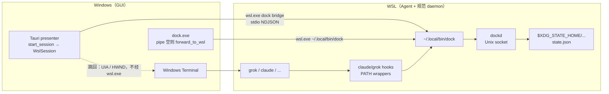
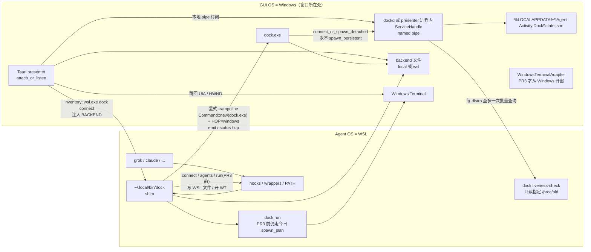
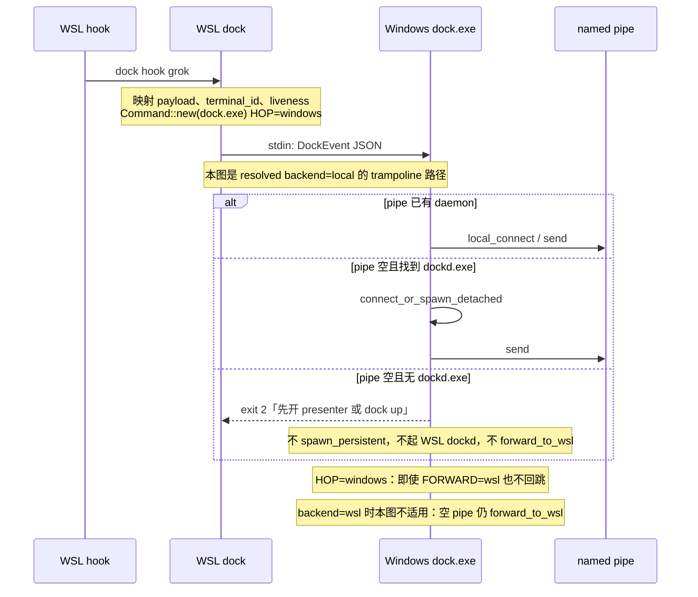
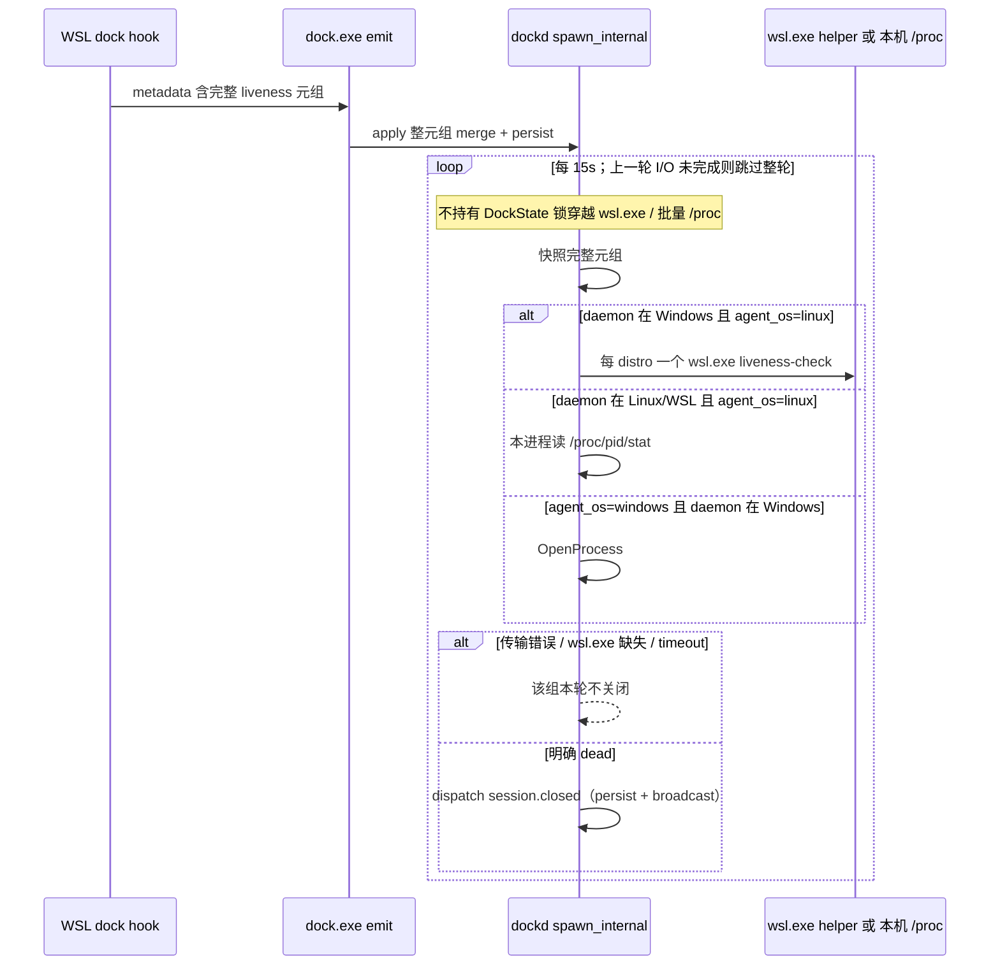
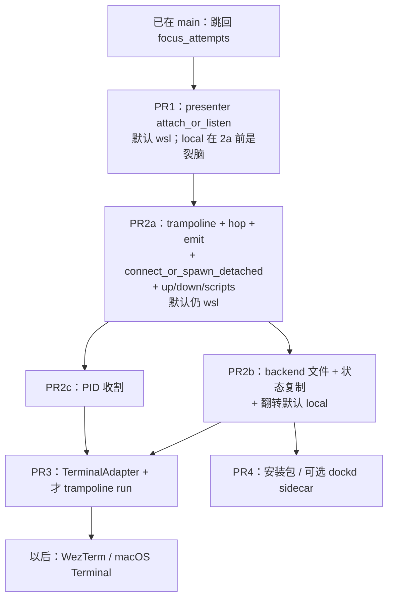

# GUI-OS 本地 daemon 迁移

| 字段 | 值 |
| --- | --- |
| 文档标题 | Agent Activity Dock：GUI-OS 本地 daemon 架构与实现设计 |
| 作者 | Agent Activity Dock contributors（待填） |
| 日期 | 2026-08-23 |
| 状态 | Draft |
| 代码基线 | workspace `0.2.0`（`Cargo.toml` / `src-tauri/tauri.conf.json`） |
| 修订 | 2026-08-23：第三轮：liveness 完整性统一为 os+pid+starttime；`agent_wsl_distro` 存储可选 |

---

## Overview

当前 Win+WSL 把 **WSL 里的 `dockd` + Unix socket** 当作唯一规范 daemon：Windows presenter 只经 `wsl.exe` 拉起 `dock bridge` attach，不自己 listen named pipe；Windows `dock.exe` 在本机 pipe 为空时把事件转发进 WSL。这条拓扑把「窗口所在 OS」和「状态所在 OS」拆开了：跳回、`dock run` 开 Windows Terminal、强制关标签后的残留会话，全部要穿过 WSL interop；macOS 与纯 Windows 终端也无法以同一套规则接入。

本设计把 daemon 固定到 **GUI 所在 OS**：presenter 始终对该 OS 的本地 endpoint 做 `attach_or_listen`；Agent 若跑在另一 OS（WSL），由该 OS 上的 `dock` CLI **显式 trampoline** 到 GUI-OS 的 `dock.exe`。每个用户仍然只有一个 `dockd`。禁止在 WSL-canonical 与 Windows-canonical 之间做静默探测切换。presenter 改 listen 本地 named pipe **不得单独发给现有 Win+WSL 用户**：本地 listen 与 trampoline 倒置必须作为同一 release 交付。

拓扑开关的持久源是 Windows 文件 `%LOCALAPPDATA%\Agent Activity Dock\backend`，不是「三个进程各自的环境变量碰巧一致」。CLI 短进程 **禁止** `spawn_persistent`：pipe 空时只 `connect_or_spawn_detached`，否则明确报错。`dock run` 在 PR3 之前仍由 WSL 侧今日的 `spawn_plan` 执行，**不**随 PR2 默认翻转一起 trampoline。

---

## Background & Motivation

### 今天的真实拓扑（已核对代码）

Win+WSL 现状：



对应实现：

- Windows presenter **永远**走 `WslSession`，经 `wsl.exe` 执行 `$HOME/.local/bin/dock bridge`（`src-tauri/src/lib.rs` 的 `start_session`，`src-tauri/src/wsl_session.rs` 的 `bridge_command` / `wsl_dock_command`）。`wsl_dock_command` **不**注入 `BACKEND` / `FORWARD` / `HOP`。
- Linux / 非 Windows presenter 已经对本机 socket 做 `attach_or_listen`（同文件 `#[cfg(not(windows))] start_session`）。
- `attach_or_listen`（`crates/dock-service/src/client.rs`）：先 `query_service`；失败则若有 `dockd` 二进制就 `spawn_detached_daemon`；再失败则进程内 `spawn_persistent`。今日 `dock.exe` 的事件/`status` 路径只 `send()` → `local_connect`；只有 `bridge` 调 `attach_or_listen`，且 `run_bridge` 在退出时 **关掉 Owned daemon**。
- Windows `dock.exe` 的 `should_forward_to_wsl`（`crates/dock-cli/src/main.rs`）：仅 Windows；`connect` / `disconnect` / `agents` / `up` / `down` 不转发；其余命令在 `AGENT_ACTIVITY_DOCK_FORWARD=wsl` **或** 本地 pipe 连不上时转发到 WSL。`forward_to_wsl` 会 `env_remove("AGENT_ACTIVITY_DOCK_FORWARD")`，并在 `SOCKET` 像 named pipe 时清掉它；今日 **不** 设 `HOP`。
- `tauri.conf.json` 的 `externalBin` 是 `binaries/dock`，**不是** `dockd`。`scripts/prepare-sidecar.mjs` 只复制 `dock`。
- `start-dock.sh` `nohup ~/.local/bin/dockd` 并写 WSL `dockd.pid`；`stop-dock.sh` `pkill -x dockd`。`install-cli.sh` 同时安装 `dock` 与 `dockd`。
- 领域规则原文（`docs/agents/domain.md`）：「不让两个 `dockd` 同时绑定同一 socket。Windows presenter 经 `dock bridge` attach，不自己 listen named pipe。」术语「状态事件」写的是「Agent 主动发送的状态变化；Dock 不从终端或进程生成事件」。
- `parse_proc_stat`（`crates/dock-cli/src/main.rs`）只返回 `(ppid, tty_nr)`，不含 starttime（`/proc/<pid>/stat` 字段 22）。
- `crates/dock-service/tests/local_service.rs` 为 `#![cfg(unix)]`。Windows CI 从未跑过 named pipe 上的 `attach_or_listen`。
- `dockd_binary_path` 现为 `#[cfg(not(windows))]`，候选是 `HOME/.local/bin` 与 `PATH`，没有 `resource_dir` / `%LOCALAPPDATA%\Agent Activity Dock\`。

### 痛点

1. **GUI 操作绑在错误的 OS 上。** 开标签、设标题、跳回、前台 HWND 捕获都是 Windows API（`crates/dock-cli/src/terminal.rs`、`src-tauri/src/focus.rs`），状态却在 WSL。`dock run` 今天从 WSL 侧拼 `wt.exe`，还要绕 WindowsApps stub、用 `wscript` 代启。
2. **订阅路径慢且脆。** 面板 snapshot 流是长期 `wsl.exe dock bridge` 子进程（`wsl_session.rs` 的 `subscribe_once`，失败 backoff 200ms–2s）。生命周期事件却只是偶发一行 JSON。热路径走了冷路径该走的 interop。
3. **关标签残留。** 用户关掉 WT 标签时 Grok 与 hook 一起被杀，`SessionEnd` 经常不到；`session.closed` 不出现，面板行留下。今天没有 PID 活性检查，也不该在即将拆除的 WSL `dockd` 上加定时器。
4. **无法扩展到 macOS / 纯 Windows。** 「Windows 是宇宙中心、daemon 永远在 WSL」把非 WSL 终端排除在外。macOS 的 spawn/focus 同样必须是 GUI-OS API。
5. **双 daemon 探测会裂脑。** WSL 在 / 不在 / 没装 dock / 只有 Windows grok，四种情况无法用「探一下」区分；会同时出现两份 `state.json`；后装 WSL 会切换世界；Windows presenter 若 listen named pipe 而 WSL `dockd` 仍在跑，Windows `dock.exe` 停止转发，WSL 事件消失。

这些已经与产品负责人达成一致，本文不重新讨论。

---

## Goals & Non-Goals

### Goals

- Presenter 在 **GUI OS** 上对当前用户 endpoint `attach_or_listen`（Windows named pipe `\\.\pipe\agent-activity-dock`，Unix 仍为既有 socket 规则）。
- Agent 在另一 OS（WSL）时，该 OS 的 `dock` **显式** trampoline 到 GUI-OS 的 `dock.exe`。不靠探测「哪边有 daemon」。
- 每个用户一个 `dockd`。禁止两个 `dockd` 争同一用户的规范 endpoint。`start-dock.sh` / `stop-dock.sh` 倒置后不得再拉起 WSL `dockd`。
- 本地 listen 与 trampoline 倒置作为 **同一 release** 交付；开发期 flag 保持旧 WSL bridge，main 在 flag 默认关闭时仍可发版。
- WSL `dock` 命令按「Agent OS 配置」vs「GUI-OS 状态」切开；`up`/`down` 不再在 WSL 起第二个 `dockd`。
- 堵住倒置后的转发环：`HOP` 硬停止。`resolved backend == local` 时 Windows `dock.exe` 不再因 pipe 空而转 WSL；`backend == wsl`（PR2a 默认）必须保留空 pipe 转发。
- Win+WSL 的规范 `state.json` 迁到 `%LOCALAPPDATA%\Agent Activity Dock\state.json`。
- `dock run` 的开窗最终是 GUI-OS `TerminalAdapter` 的工作（PR3）。**PR2 默认翻转不 trampoline `run`**，以免 Windows `resolve_agent` 在错误的 PATH 上找 grok。
- 在 GUI-OS daemon 上绑定 **单 PID + starttime** 活性收割（PR2c）：仅 hook 记录的进程没了就发 `session.closed`。不扫进程表，不用 HWND 死亡删会话，不从 `dock start`/`complete` 记 wrapper PPID。
- 更新 `docs/agents/domain.md` 的术语、第一条边界、以及 presenter listen 那一条。
- 跳回 v2 已在 main：不回退、不重做。

### Non-Goals

- 不为 working 状态加 heartbeat（继续遵守 `docs/adr/0002-explicit-events-without-heartbeats.md`）。
- 不靠扫进程表做跳回；不把 HWND / `WT_SESSION` / AppleScript id 放上事件契约。
- 本期不实现 WezTerm、macOS Terminal.app 适配器（只定 seam）。
- 不把安装包 / GitHub Releases 当作拓扑 PR 的门禁（可后续 PR）。
- 不强迫用户重新 `dock connect`；不替换 Agent 本体。
- 不把摘要、transcript、窗口标题写入 `state.json`。
- 不在 WSL 里跑 Linux Tauri / WSLg 当 presenter。
- 不把 `project_path` 做 WSL↔Windows 路径翻译（事件契约：发送侧原样保存；迁到 Windows `state.json` 后仍是 WSL 路径）。
- CLI 短进程不 `spawn_persistent`（那会在 `dock.exe emit` 退出时带走 daemon）。

---

## Key Decisions

| 决策 | 选择 | 理由 |
| --- | --- | --- |
| 拓扑 | Presenter 始终在 GUI OS 上 `attach_or_listen`；跨 OS 只用显式 trampoline | daemon 必须跟窗口、跳回、`dock run` 同机；macOS / 纯 Windows 才能共用规则 |
| 不是 Windows 宇宙中心 | 规范位置是 **GUI OS**，不是「永远 Windows」 | macOS 与其它终端在范围内；spawn/focus 用 GUI-OS API |
| 禁止双模探测 | 不用「WSL 在不在」在两套 daemon 间 fallback | 四种安装状态不可分；两份 `state.json`；后装 WSL 换世界；pipe listen + WSL `dockd` 裂脑 |
| 发版耦合 | PR1 默认仍走 WSL bridge；PR2a 倒置 trampoline（默认仍 `wsl`）；PR2b 写 backend 文件并翻转默认；PR2c PID 收割。**同一 release 出去** | 今天 `dock.exe` 在 pipe 空时转 WSL；presenter 一旦本地 listen，转发停止，WSL 事件蒸发 |
| 拓扑源 | `%LOCALAPPDATA%\Agent Activity Dock\backend` 为持久源；环境变量覆盖当前进程；Windows 调 `wsl.exe` 时注入解析后的值 | Windows 环境变量默认进不了 WSL；只设 presenter 的 `BACKEND=wsl` 会造成 bridge 订 WSL socket、shim 却 trampoline 到 pipe |
| 回滚开关 | 文件或 `AGENT_ACTIVITY_DOCK_BACKEND=wsl\|local`。`FORWARD=wsl` 仅作 `dock.exe` 紧急回滚，与 `local` 同时开是不支持组合，启动时警告 | 单一显式开关，不探测；hop 只防环，不选拓扑 |
| 升级顺序 | **先（或同时）装带 trampoline+hop 的 WSL `dock`，再翻转 presenter 默认** | 旧 shim + 新 presenter listen = Alternative D 裂脑 |
| WSL CLI 切分 | `connect`/`disconnect`/`agents`/`liveness-check`/`run`（直至 PR3）留在 Agent OS；事件/`status`/`ack`/`reset`/`up`/`down`/`bridge`/`emit` 去 `dock.exe` | hooks 与 PATH 必须写在 WSL；`run` 在 PR3 前必须用 Linux `resolve_agent` + 今日 `spawn_plan` |
| CLI 生命周期 | 新增 `connect_or_spawn_detached`。Presenter 仍用 `attach_or_listen`（允许进程内 listen）。`dock.exe emit`/`status`/`ack`/`reset`/`run`/`bridge` **永不** `spawn_persistent` | 今日 `attach_or_listen` 最终会 `spawn_persistent`；短 CLI 一退出 Owned daemon 就死，Remote presenter 丢订阅 |
| 防环 | `HOP` 已有值则既不 trampoline 也不 forward。空 pipe 转发：**仅 `resolved backend == wsl` 时保留（今日行为）**；`local` 时关掉 | PR2a 默认仍是 `wsl`，Windows `dock.exe` 必须还能把事件打进 WSL `dockd`。`local` 后空 pipe 再 forward 会成环 |
| 状态迁移 | **一次性复制**；listen 先行；cat 后持 `DockState` 锁：空则 `from_persisted`+persist+broadcast，非空则 `dest_non_empty`。`wsl.exe` 限时 2s，永不挡住 GUI | 无锁会把 listen 后的新 hook 盖掉；挂起的 WSL 不能让 exe 起不来 |
| `dock run` | PR2 **不** trampoline `run`。PR3 再把开窗收到 GUI-OS `TerminalAdapter`，WSL 只收集 Linux 上下文 | PR2 整 argv 转发会让 Windows `resolve_agent` 找错 grok，毁掉 `dock:` 跳回通道。默认翻转不依赖 PR3 |
| 跳回 | 保持已落地阶梯：deep_link → `dock:` marker → HWND → 诚实失败 | 不回退；进程扫描解决不了 WT 多标签 |
| 关标签残留 | **仅** `run_hook` 记录 `$PPID`+starttime；`dock start`/`complete` 不记。收割器问「这一个 PID 是否仍是原进程」。`dock.exe emit` 不再 `attach_liveness` | wrapper 的 PPID 是 wrapper shell，`complete` 后 ~15s 会被误 `session.closed`，删掉应保留的 tracked 行和 `dock:` 跳回 |
| liveness 范围 | 存储/merge 完整性永远是 `os+pid+starttime`；`agent_wsl_distro` 可选（有 `WSL_DISTRO_NAME` 才写）。收割：Windows 宿主+linux 且缺 distro则跳过；Linux/WSL 宿主忽略 distro、本进程读 `/proc`；Windows 宿主对 windows pid 用 `OpenProcess` | Linux 桌面没有 `WSL_DISTRO_NAME`；若 merge 强制 distro，本机 `/proc` 收割会变成空操作 |
| presenter 是否绑 `dockd.exe` sidecar | **拓扑 PR 不强制**。Presenter：`attach_or_listen`。CLI：没有 `dockd.exe` 且 pipe 空 → 明确错误，不起 WSL `dockd` | 今日 sidecar 只有 `dock`；进程内 listen 与 Linux presenter 一致；安装包后续再带 `dockd.exe` |
| 隐私 | 继续无网络；持久化路径用于分组；不持久化摘要/正文 | 「不持久化 `project_path`」过严，且已经修好 |

---

## Proposed Design

### 目标拓扑



同一套规则在其它 GUI OS 上的投影：

| GUI OS | 规范 endpoint | Agent 在本机 | Agent 在 WSL |
| --- | --- | --- | --- |
| Windows | `\\.\pipe\agent-activity-dock` | `dock.exe` 直连 pipe | WSL `dock` trampoline → `dock.exe`（`run` 直至 PR3 除外） |
| Linux 桌面 | `$XDG_RUNTIME_DIR/...sock` | 已是 `attach_or_listen`，无 trampoline | 不支持（不在 WSL 里跑 Linux Tauri） |
| macOS（后续） | Unix socket | 本机 `dock` 直连 | 无 WSL；若将来有跨 OS Agent，再加显式 trampoline |

**仍然：每个用户一个规范 daemon。** 不存在「Windows 一份 + WSL 一份」的静默双活。

### 拓扑源：backend 文件（显式，不探测）

持久源：

```text
%LOCALAPPDATA%\Agent Activity Dock\backend
```

UTF-8，第一行 trim 后大小写不敏感为 `wsl` 或 `local`。可选第二行 JSON 注释实现细节，解析只认第一行。文件不存在视为「用编译默认」。

解析顺序（Windows 上的 presenter / `dock.exe`）：

1. 进程环境 `AGENT_ACTIVITY_DOCK_BACKEND` 若为 `wsl` 或 `local` → 用它（当前进程覆盖，不自动写回文件）。
2. 否则读 backend 文件。
3. 否则 `default_for_build()`：PR1 与 PR2a = `wsl`；PR2b 起 = `local`。

WSL shim 解析顺序：

1. 进程环境 `AGENT_ACTIVITY_DOCK_BACKEND`（Windows 侧 `wsl.exe` 必须注入，见下）。
2. 否则读同一份 Windows 文件：用 `find_windows_dock` 同源的 `LOCALAPPDATA` 发现（`cmd.exe /c echo %LOCALAPPDATA%` 只用于发现路径，**不**用来启动 `dock.exe`），再 `wslpath -u`。
3. 否则 `WSL_DISTRO_NAME` 非空时跟编译默认；纯 Linux 桌面忽略该文件，永远本机 socket。

**禁止**用 pipe 在不在、WSL 在不在、`state.json` 在哪来推断 backend。读 backend 文件是读拓扑开关，不是双模 daemon 探测。

Windows 调用 `wsl.exe` 时（presenter inventory / bridge 回滚 / 收割 helper / 状态迁移 cat）必须带上解析后的值：

```text
wsl.exe [-d DISTRO] -e sh -c 'exec "$HOME/.local/bin/dock" "$@"' sh …
  env: AGENT_ACTIVITY_DOCK_BACKEND=<resolved>
       WSLENV=AGENT_ACTIVITY_DOCK_BACKEND/u   （若还需要其它变量再追加）
```

`src-tauri/src/wsl_session.rs` 的 `wsl_dock_command` 与 CLI 的 `forward_to_wsl` 都要注入。不要指望用户在 WSL `~/.bashrc` 里 export。

PR2b 翻转默认时：Windows presenter 或 `dock.exe` **第一次**以编译默认 `local` 启动且文件不存在，则写入 `local`。回滚：用户把文件改成 `wsl`，或在 Windows 用户环境设 `AGENT_ACTIVITY_DOCK_BACKEND=wsl`（presenter 会注入进所有 `wsl.exe`）。只改 WSL 内环境、不改文件，下一次没注入的 Windows 进程仍按文件走。

`AGENT_ACTIVITY_DOCK_FORWARD=wsl` 仅 Windows `dock.exe` 使用。与解析结果 `local` 同时出现时：

- hop 仍禁止回跳（防环）；
- 启动时 stderr **警告**不支持组合（两份 `state.json` 风险）；
- 不把它升级成受支持的双模。

| 解析结果 | Presenter | WSL `dock` | Windows `dock.exe` |
| --- | --- | --- | --- |
| `wsl` | 现有 `WslSession` + `dock bridge` | 本机 Unix socket，可 `dock up` 起 WSL `dockd` | pipe 空或 `FORWARD=wsl` 时转发 WSL（今日行为），且设 `HOP=wsl` |
| `local` | GUI OS `attach_or_listen` | 事件/查询/`up`/`down`/`bridge` trampoline 到 `dock.exe`；**`run` 直至 PR3 仍本机** | **默认不**转发 WSL；pipe 空则 `connect_or_spawn_detached` |

### Hop 令牌与规范 trampoline 启动路径

```text
AGENT_ACTIVITY_DOCK_HOP=windows | wsl
```

规则：

- **只要 `HOP` 已有值：禁止 trampoline，也禁止 `forward_to_wsl`，即使 `FORWARD=wsl`。** stderr 打一行 `dock: refusing hop, AGENT_ACTIVITY_DOCK_HOP already set`。这是环的硬停止，比 backend 更底层。
- Hop **不是**拓扑开关。拓扑只看 backend 文件 / `BACKEND`。

WSL → Windows 的规范启动（`emit` 及其它 trampoline 命令）：

```rust
// 发现 dock.exe 可以用 cmd.exe echo %LOCALAPPDATA%；启动不能。
let mut cmd = std::process::Command::new(&windows_dock_exe); // 例如 /mnt/c/Users/…/dock.exe
cmd.args(windows_args);           // emit 无额外 argv，JSON 走 stdin
cmd.stdin(Stdio::piped());        // emit 必须保住 stdin
cmd.stdout(Stdio::piped());
cmd.stderr(Stdio::inherit());
cmd.env("AGENT_ACTIVITY_DOCK_HOP", "windows");
cmd.env("AGENT_ACTIVITY_DOCK_BACKEND", resolved_backend);
cmd.env_remove("AGENT_ACTIVITY_DOCK_SOCKET"); // Unix 路径对 dock.exe 无意义
cmd.env_remove("XDG_RUNTIME_DIR");            // 避免 Windows 侧误拼 socket
// 不要 cmd.exe /c，不要 powershell.exe -Command（丢 stdin / 丢 Unix 设的环境）
```

WSL interop 直接 exec PE 会保留环境与 stdin；这是安全混版本（新 shim + 仍会在 pipe 空时 forward 的旧 `dock.exe`）的前提：旧 `dock.exe` 只要看到 `HOP=windows` 就不准回跳。因此 **PR2a 必须给 `should_forward_to_wsl` 加上「`HOP` 已设则 false」**，即使编译默认仍是 `wsl`。**PR2a 不得删掉「解析结果 `wsl` 且 pipe 空则转发」**——默认仍是 WSL-canonical，Windows `dock.exe` 的 hook/`status` 只能靠这条到达 WSL `dockd`。空 pipe 转发只在解析结果 **`local`** 时关掉（PR2b）。

Windows → WSL（回滚路径 `forward_to_wsl`）：

- 现有：`env_remove("AGENT_ACTIVITY_DOCK_FORWARD")`；pipe 形态 `SOCKET` 则 `env_remove`。
- 新增：`env("AGENT_ACTIVITY_DOCK_HOP", "wsl")`，并注入 `BACKEND=wsl`。
- 仍用 `wsl.exe -e sh -c 'exec "$HOME/.local/bin/dock" "$@"' sh`（非 login PATH）。

查找 Windows `dock.exe`（`find_windows_dock`，风格对齐 `find_wt` / `find_wsl`）：

1. `AGENT_ACTIVITY_DOCK_WINDOWS_DOCK`
2. `cmd.exe /c echo %LOCALAPPDATA%` → `{localappdata}/Agent Activity Dock/dock.exe`（经 `wslpath -u`）——仅发现
3. `/mnt/c/Users/$USER/AppData/Local/Agent Activity Dock/dock.exe`
4. 开发期：`AGENT_ACTIVITY_DOCK_WINDOWS_DOCK` 指向 sidecar / cargo 产物

找不到则错误退出，提示安装 Windows presenter。不要 fallback 到 WSL `dockd`。



`should_forward_to_wsl` 规范谓词（hop 段、PR2a、测试表共用这一份；`resolved backend` 按拓扑源解析）：

```text
if not cfg!(windows)              → false
if command not forwardable        → false   // connect/disconnect/agents/up/down 今日已排除
if HOP is set                     → false   // 环硬停止；stderr refusing hop
if resolved backend == local      → FORWARD=wsl only
                                    // 空 pipe 不再转 WSL；FORWARD=wsl 是不支持组合，hop 仍堵环
if resolved backend == wsl        → FORWARD=wsl || pipe empty
                                    // 今日行为；PR2a 必须保留
```

PR2a 只加 `HOP` 短路径，**保留** `wsl` 行的空 pipe 转发。PR2b 翻转默认到 `local` 之后，空 pipe 才走 `connect_or_spawn_detached` 而不是 `forward_to_wsl`。

### CLI：`connect_or_spawn_detached`（永不 `spawn_persistent`）

在 `crates/dock-service/src/client.rs` 新增，与 `attach_or_listen` 并列：

```rust
pub enum DetachedConnectError {
    NeedPresenterOrDockd,
    Io(std::io::Error),
}

/// CLI 短进程用。成功则 endpoint 上已有可 query 的 daemon（Remote）。
/// 绝不 spawn_persistent。参数与 `attach_or_listen` 对齐：
/// `state_path` 用来推导 `dockd.log` / `dockd.pid`（`state_path.parent()`，
/// 与今日 `attach_or_listen` / `dock up` 的 `runtime_state_dir` 同一处）。
pub fn connect_or_spawn_detached(
    endpoint: impl Into<PathBuf>,
    state_path: impl Into<PathBuf>,
    dockd: Option<PathBuf>,
) -> Result<PathBuf, DetachedConnectError> {
    let endpoint = endpoint.into();
    let state_path = state_path.into();
    if query_service(&endpoint, &IpcRequest::Snapshot).is_ok() {
        return Ok(endpoint);
    }
    let log_path = state_path
        .parent()
        .map(|parent| parent.join("dockd.log"))
        .unwrap_or_else(|| PathBuf::from("dockd.log"));
    let pid_path = state_path
        .parent()
        .map(|parent| parent.join("dockd.pid"))
        .unwrap_or_else(|| PathBuf::from("dockd.pid"));
    if let Some(binary) = dockd.filter(|path| path.is_file()) {
        spawn_detached_daemon(&binary, &log_path, &pid_path)?;
        for _ in 0..25 {
            if query_service(&endpoint, &IpcRequest::Snapshot).is_ok() {
                return Ok(endpoint);
            }
            thread::sleep(Duration::from_millis(80));
        }
    }
    Err(DetachedConnectError::NeedPresenterOrDockd)
}
```

调用方传 `default_state_path()`（或 CLI 已解析的 state 路径）。不要把 log/pid 写到 cwd，否则 `dock down` 找不到 `dockd.pid`。

谁用什么：

| 调用方 | 函数 | Owned in-process? |
| --- | --- | --- |
| Presenter `start_local_session` | `attach_or_listen` | 允许（GUI 活着时就是 daemon） |
| Linux 桌面 presenter | `attach_or_listen` | 允许（今日行为） |
| `dock.exe emit` / `status` / `ack` / `reset` | `connect_or_spawn_detached` 然后 `send` | **禁止** |
| `dock.exe bridge`（被 WSL trampoline） | `connect_or_spawn_detached`；**不要**在退出时 shutdown 分离 dockd | **禁止** Owned |
| `dock up`（Windows 或 WSL trampoline 之后） | 只 `spawn_detached_daemon`；没有 `dockd.exe` 则错误 | **禁止** |
| 今日 `run_bridge` 的 `attach_or_listen` + shutdown Owned | 倒置后废弃这条路径 | — |

`NeedPresenterOrDockd` 的用户可见文案：「cannot reach Dock named pipe; start the presenter or `dock up` (requires dockd.exe)」。exit 2。**不起** WSL `dockd`。

在 PR4 打包 `dockd.exe` 之前，关 presenter 后的 WSL hook 会走错误路径——这是接受的：拓扑 PR 不强制 sidecar。测试矩阵必须覆盖「明确错误、不环、不起 WSL dockd」。

### Presenter：`attach_or_listen`（PR1，flag 默认关）

今日 Windows 与非 Windows 在 `start_session` 分叉。目标是 Windows 在解析结果 `local` 时与 Linux 共用 `start_local_session`。

需要改动的缝：

1. `src-tauri/src/lib.rs`
   - 把 `use attach_or_listen, DockSession` 和 `impl PresenterSession for DockSession` 的 `#[cfg(not(windows))]` 拿掉。
   - `dockd_binary_path()` 对 Windows 生效，候选对齐 `dock_binary_path`（见下）。
   - 抽出共享的 `start_local_session`；Windows `start_session` 按解析结果分支。

```rust
fn presenter_backend() -> PresenterBackend {
    // 1. env 2. backend 文件（仅 Windows）3. default_for_build()
}

fn start_local_session() -> (Arc<dyn PresenterSession>, Receiver<SnapshotMessage>, SnapshotMessage) {
    let session = attach_or_listen(
        agent_activity_dock_ipc::default_endpoint(),
        agent_activity_dock_ipc::default_state_path(),
        dockd_binary_path(),
    )
    .unwrap_or_else(|error| {
        eprintln!("Agent Activity Dock service failed to start: {error}");
        std::process::exit(1);
    });
    // 现有 listening/attached 日志 + snapshot/subscribe
}

#[cfg(windows)]
fn start_session() -> (Arc<dyn PresenterSession>, Receiver<SnapshotMessage>, SnapshotMessage) {
    match presenter_backend() {
        PresenterBackend::Wsl => start_wsl_bridge_session(),
        PresenterBackend::Local => start_local_session(),
    }
}

#[cfg(not(windows))]
fn start_session() -> (Arc<dyn PresenterSession>, Receiver<SnapshotMessage>, SnapshotMessage) {
    if presenter_backend() == PresenterBackend::Wsl {
        eprintln!("Agent Activity Dock: AGENT_ACTIVITY_DOCK_BACKEND=wsl is ignored on this OS");
    }
    start_local_session()
}
```

非 Windows：**忽略** `BACKEND=wsl`（打警告），仍然 `attach_or_listen`。没有 WSL bridge 可回滚。

2. **`wsl_session.rs` 继续存在**，职责是 **WSL Agent 配置**（`raw_inventory` / `preview_connect` / `connect_agent` / `disconnect_agent`）以及 `BACKEND=wsl` 回滚时的 snapshot 订阅。`wsl_dock_command` 必须注入解析后的 `BACKEND`。
3. 跳回继续只走 `src-tauri/src/focus.rs`，**不**经 `wsl.exe` 问 daemon。PR1 不得改 `focus_attempts` 阶梯。

`dockd_binary_path` 候选（Windows 与 Linux 共用函数，不再 `cfg(not(windows))`）：

1. `AGENT_ACTIVITY_DOCK_DOCKD`
2. `app.path().resource_dir()` 下 `binaries/dockd-{target}.exe`、`dockd.exe`、`dockd`（presenter 内；CLI 无 AppHandle 则跳过）
3. `current_exe().parent()`：`dockd.exe` / `dockd` / `binaries/` 同名
4. `%LOCALAPPDATA%\Agent Activity Dock\dockd.exe`（Windows）
5. `HOME/.local/bin/dockd`（Unix）
6. `PATH`

CLI 的 `dockd_binary()` 采用同一列表（无 resource_dir）。

**PR1 的 `BACKEND=local` 在 PR2a 之前是裂脑（dev-incomplete）。** Presenter listen → `dock.exe` 因 pipe 已有 listener 停止转发 → 旧 WSL hooks 仍打 WSL `dockd`。文档与 PR1 描述必须写明：除了手工安装已带 trampoline 的 WSL shim 做开发试验外，不要设 `BACKEND=local`。默认保持 `wsl`。

#### Inventory / connect（两种 backend）

| Backend | 面板 snapshot / subscribe | `side=windows` connect | `side=wsl` connect / agents |
| --- | --- | --- | --- |
| `local` | `DockSession` → named pipe | presenter 进程内 `ConnectionManager`；Windows hook 调用 **Windows `dock.exe`** | `wsl.exe dock agents\|connect\|disconnect`（**不** trampoline）；WSL hook 写入 **`~/.local/bin/dock`**，不是 Windows 路径 |
| `wsl` | `WslSession` → `dock bridge` | 同上（Windows PATH 工具仍由 Windows `ConnectionManager` 连） | 同上 |

`load_fresh_inventory` 在 `local` 下仍然混合 Windows `ConnectionManager` + `wsl_session::raw_inventory()`。解开 `DockSession` 的 cfg 时不要误删 `wsl_session` 的 inventory 调用。

单测：`should_trampoline_to_windows` 对 `Agents` / `Connect` / `Disconnect` / `LivenessCheck` / `Run`（PR3 前）为 false。

### WSL `dock` CLI 切分（PR2a）

`should_trampoline_to_windows`：Linux 二进制；解析 backend == `local`；`HOP` 未设；命令在下表「去 Windows」列。

「像 WSL」不是探 daemon：有 `WSL_DISTRO_NAME` 或能读到 Windows backend 文件或 `AGENT_ACTIVITY_DOCK_WINDOWS_DOCK`。纯 Linux 桌面不 trampoline。

命令表（`BACKEND=local` 且在 WSL）：

| 命令 | 行为 | 理由 |
| --- | --- | --- |
| `connect` / `disconnect` / `agents` | **留在 WSL** | 写 WSL `settings.json`、`~/.grok/hooks`、PATH、`connections.json` |
| `liveness-check`（隐藏） | **留在 WSL** | 只读本机 `/proc/<pid>` |
| `run` | **留在 WSL 直到 PR3** | 今日 `spawn_plan` + Linux `resolve_agent`；整 argv 转发到 `dock.exe run` 会在 Windows PATH 上解析 grok |
| `hook` / `start` / `working` / … | 映射后 `dock.exe emit` | 状态在 GUI-OS daemon |
| `status` / `acknowledge` / `reset` | trampoline 原 argv | 查规范 daemon |
| `up` / `down` | trampoline 到 `dock.exe up/down` | **禁止**再起 WSL `dockd` |
| `bridge` | trampoline 到 `dock.exe bridge` | 避免 WSL `attach_or_listen` 造第二份 daemon |
| `emit`（隐藏） | Windows 侧 `connect_or_spawn_detached` + `send` | 保留 `parent_session_id`、metadata、liveness |

`hook` 不能整段 argv 转发。`EventArgs` 没有 `--parent-session-id`。流程：

1. WSL `run_hook`：映射 payload → `attach_terminal_id` → **仅 hook 路径** `attach_liveness` → `maybe_set_terminal_title`。
2. `event_request`（`dock start` / `complete` 等）：`attach_terminal_id` + 标题；**不** `attach_liveness`。
3. 若应 trampoline：一行 JSON 交给 `Command::new(dock.exe) emit`（stdin）。
4. `dock.exe emit`：**只** `connect_or_spawn_detached` + `send`。不解析 hook，不 `attach_liveness`，不 `attach_terminal_id`，不写标题。父进程是 `wsl.exe` / interop，再取 PPID 会覆盖成 Windows PID。

人工 `dock start` 从 WSL 走同一 `emit` 序列化，避免两套路径。

`up`/`down`：WSL 不再 `start_daemon`/`stop_daemon`（会写 WSL `dockd.pid` 并 `pkill -x dockd`）。Windows `dock up` 只分离拉起 `dockd.exe`；没有则错误并提示 presenter。

`scripts/windows/dock.ps1` / `dock.cmd`：优先同目录或 PATH 上的 `dock.exe`；仅解析结果 `wsl` 时保留旧 WSL 转发。

`start-dock.sh`：改为 `"$dest/dock" up`（`local` 下 trampoline 到 Windows）。不要 `nohup dockd`。若解析为 `wsl`，`dock up` 仍起 WSL `dockd`（回滚）。`stop-dock.sh` 改为 `"$dest/dock" down`，删除无条件 `pkill -x dockd`（那杀不到 `dockd.exe`，却会误杀回滚用的 WSL daemon 以外的东西——统一走 `dock down`）。

`install-cli.sh`：继续安装 `dockd` **仅作 `BACKEND=wsl` 回滚二进制**，并在 echo 里写明规范 daemon 是 GUI-OS。不把 WSL `dockd` 当默认。

### 事件契约与标题（不变 + 小扩展）

传输、字段上限、生命周期类型、`terminal_id` 解析顺序、标题 OSC/`SetConsoleTitleW`、跳回阶梯：**保持** `docs/event-contract.md` 现状。

可移植线上身份仍然只有 `terminal_id`（含 `dock:` + 6 hex）与可选 `deep_link`。**不上线：** HWND、`WT_SESSION`、AppleScript id、Win32 PID。

PID 活性用已有 `metadata` map（上限 32 项、key/value 各 256 字节）：

| key | 值 |
| --- | --- |
| `agent_os` | `linux` 或 `windows` |
| `agent_pid` | 十进制 PID |
| `agent_starttime` | Linux：`/proc/<pid>/stat` 字段 22（boot ticks）；Windows：`GetProcessTimes` 的 `FILETIME` 十进制 |
| `agent_wsl_distro` | **可选。** `WSL_DISTRO_NAME` trim 非空时写入；Linux 桌面 / Windows 原生为 `None`。不是 merge 完整性的一部分 |

`DockEvent` 不升 `version`。daemon 把 liveness **整元组** merge 进 `SessionRecord` / `PersistedSession`（见 Data Model）。不进入 `SessionSnapshot`。摘要仍不持久化。

### `attach_liveness`（仅 `run_hook`）

**不**在 `event_request` 里调用。wrapper 生成的 `dock start`/`complete` 是 Agent 的兄弟进程，PPID 是 wrapper shell；`wait` 后 shell 退出，收割器会在 ~15s 后对本应留在 `tracked_count` 的 completed 行发 `session.closed`（见 `docs/event-contract.md`：只有 `session.closed` 才从打开列表移除）。这是产品行为，不是边缘情况。

Unix（WSL hook 与 Linux 桌面 hook 同一条路径）：

- `pid = libc::getppid()`。
- 读 `/proc/{pid}/stat`。扩展今日 `parse_proc_stat`：`)` 之后 `split_whitespace`，下标 0=state、1=ppid、4=tty_nr、**19=starttime（字段 22）**。函数改为返回 `(ppid, tty_nr, starttime: u64)`，或新增 `parse_proc_stat_liveness` 以免搅乱 tty 测试；推荐扩展元组并改现有 `proc_stat_tty_nr_decodes_like_unix98_pts`。
- comm 含空格：继续用 `rfind(')')` 切，现有 `parse_proc_stat` 已如此。单测必须覆盖 `12 (my (weird) name) R 99 …` 且 starttime 字段仍对齐。
- `agent_os=linux`。`agent_wsl_distro`：仅当 `WSL_DISTRO_NAME` trim 非空时写入；否则 **省略 distro，仍写出 os+pid+starttime**（Linux 桌面没有该变量，不能因此丢掉整组）。
- pid/starttime 读失败 → 省略整组 liveness，不要猜。缺 distro **不是**读失败。

Windows 原生 hook（`dock.exe hook`，Agent 与 GUI 同 OS）：

- `CreateToolhelp32Snapshot(TH32CS_SNAPPROCESS, 0)` + `Process32FirstW` / `Process32NextW`，匹配 `th32ProcessID == GetCurrentProcessId()`，取 `th32ParentProcessID`。
- `OpenProcess(PROCESS_QUERY_LIMITED_INFORMATION, 0, parent)`。
- `GetProcessTimes` → `lpCreationTime` 作为 `u64`。
- `ERROR_ACCESS_DENIED` 或失败 → **省略** liveness（不要猜）。收割侧对已记录 PID：`ERROR_ACCESS_DENIED` 视为仍活着。
- 发行位宽：只提供与 presenter 相同的 x86_64（或 arm64）`dock.exe`。32 位 `dock.exe` 对 64 位 grok 的 Toolhelp 不在范围内。

子代理事件（有 `parent_session_id`）不写 liveness。不 `readdir /proc`，不枚举全表。

### PID 活性收割（PR2c，GUI-OS `dock-service` 线程）

问题：关 WT 标签 → Grok + hook 被杀 → `session.closed` 经常不到。Claude `SessionEnd` 今日映射成 `Completed`（`crates/dock-adapters/src/lib.rs`），行留在 `tracked_count`。收割器补的是 **hook 会话**在进程被杀时的 `closed`，不是 wrapper 正常结束后的行。

收割器活在规范 daemon 的 `spawn_internal` 后台线程（Linux presenter / WSL `dockd` 回滚 / Windows `dockd` 都会走到这里）。**按 daemon 宿主分支**，不要一律调 `wsl.exe`：

| daemon 宿主 | `agent_os=linux` | `agent_os=windows` |
| --- | --- | --- |
| Windows | 有 distro：`wsl.exe -d {agent_wsl_distro}` helper；**无 distro：跳过** | 本进程 `OpenProcess` + `GetProcessTimes` |
| Linux 桌面或 WSL 内的 `dockd` | 本进程读 `/proc/<pid>/stat`；**忽略** distro（PID 已是本机命名空间） | 不适用（没有 Windows PID） |

2c 不依赖 2b：默认仍是 `wsl` 时规范 daemon 在 WSL，必须走「本进程 `/proc`」支路。Linux GUI 同理。只有 Windows 宿主才起 `wsl.exe`。



规则：

- 存储/merge 完整性（attach、`update_record`、收割入口共用）：永远是 `agent_os` + `agent_pid` + `agent_starttime`。缺这三项之一 → 不当作有 liveness。`agent_wsl_distro` **不是**这三项的一部分。
- 收割额外规则（不改变存储完整性）：**Windows 宿主** + `agent_os=linux` 且 distro 缺失 → **跳过**该会话（不要用默认 distro 去猜 `/proc`）。Linux/WSL 宿主忽略 distro，本进程读 `/proc`。
- Windows 宿主 + linux pid：**distro 缺失则跳过该会话**（不猜默认发行版）。有 distro：`wsl.exe -d {agent_wsl_distro} -e sh -c 'exec "$HOME/.local/bin/dock" "$@"' sh liveness-check`。非 login PATH；与 `wsl_dock_command` 相同。注入 `BACKEND` 与 `HOP`（helper 不得 trampoline：命令在「留在 WSL」表，且可设 `HOP=wsl` 双保险）。每轮每 distro **一个** `wsl.exe`，timeout **2s**。`wsl.exe` 不在 PATH → 跳过该 Linux 组。
- stdin JSON 数组，stdout `{ "dead": [ { "source", "session_id", "pid", "starttime" } ] }`。只读 `/proc/<pid>/stat` 比对 starttime；不 `readdir /proc`。pid 不存在或 starttime 不符 → dead。读权限错误 → 该 pid 视为 unknown，**不**进 `dead`。
- Linux/WSL 宿主：同一比对逻辑编进 `dock-service`（或抽到与 `liveness-check` 共用的函数），直接读 `/proc`，不 spawn。
- Windows 原生 pid：`OpenProcess(PROCESS_QUERY_LIMITED_INFORMATION)` + `GetProcessTimes`。进程不存在 / starttime 不符 → dead。`ERROR_ACCESS_DENIED` → alive。
- 上一轮 helper / 批量 `/proc` 未完成 → **跳过整轮**，不准叠两个 `wsl.exe`。
- **不要**持有 `Mutex<DockState>` 穿越 `wsl.exe`。克隆要检查的元组，I/O 后再锁。本进程 `/proc` 读也先 clone 再查，避免把 accept 线程卡住。
- `session.closed` 必须走与 `handle_client` 相同的 persist + `broadcast`（`updates` 订阅者）。直接改 `DockState` 而不 broadcast，小球要等到下一次 query 才动。
- helper 失败 / timeout / WSL 暂停 → 本轮不关闭。发行版重启后 starttime 对不上，下一轮成功查询再关。
- 只发 `session.closed`。不根据 PID 活着推断 working/waiting（ADR 0002）。
- **不**因 HWND 销毁删会话。
- `event_id` 必须 ≤ `MAX_EVENT_ID_LEN`（128）。**禁止** `dock-liveness-{source}-{session_id}-{pid}-{starttime}`（`session_id` 上限 256，必超）。规范：

```text
dock-liveness-{hex16}
```

`hex16` = SHA-256(`source || 0x1f || session_id || 0x1f || pid || 0x1f || starttime`) 的前 8 字节 hex（16 个十六进制字符）。总长 14+16=30 ≤ 128。人类字段只进 debug 日志，不进 `event_id`。单测：256 字节 `session_id` 的 closed 必须 `accepted`。

- 收割间隔 15s。Windows 宿主上 `wsl.exe` 缺失则跳过跨 OS Linux 组，从而 **每 15s 最多唤醒一次 WSL**；不要在循环里重试把发行版从睡眠里拉起来。Linux/WSL 宿主不调用 `wsl.exe`。
- `stopping` 为真时线程退出。

领域文档（PR2c 与拓扑句同一批，避免「窄例外」写在文末却输给第一条）：

术语「状态事件」改为：

> 状态事件：Agent 或其 hook **主动发送**的状态变化。Dock 不从终端输出或全进程表推断 working/waiting。允许的唯一进程派生事件是：对 hook 已记录的那一个 PID+starttime 查询「是否仍是原进程」，若已死亡则补发 `session.closed`。

第一条「不要违反的边界」改为：

> 不读取 transcript、prompt、命令、代码、终端输出；不扫描进程表来猜 working/waiting；允许对 hook 记录的单一 PID 做活性查询，且只用于 `session.closed`。

最后一条改为：

> 不让两个 `dockd` 同时服务同一用户。Presenter 在 GUI OS 上 `attach_or_listen`；仅当 Agent 跑在另一 OS（WSL）时由该 OS 的 `dock` trampoline 把事件送到这个 daemon。禁止在 WSL-canonical 与 GUI-OS-canonical 之间静默切换。

### 状态文件迁移（PR2b）

今日 Win+WSL 规范文件是 WSL `$XDG_STATE_HOME/agent-activity-dock/state.json`。Windows presenter 的小球坐标已在 `%LOCALAPPDATA%\Agent Activity Dock\ball-position.json`。倒置后规范会话文件是 Windows `default_state_path()`。

**一次性复制，而不是丢分组。** `project_path` 按发送侧原样保存（多为 WSL 路径）；迁到 Windows 文件后 **不做**盘符翻译。面板分组继续用路径字符串，这不是 bug。

**不得在 listen 之前无超时地调 `wsl.exe`。** 今日 `load_state` 是读文件或空；挂起的 WSL 不能让 presenter 变成「exe 永远不出现」（旧 bridge 至少有 8s `recv_timeout` 后空 snapshot）。

算法：

1. 先 bind named pipe / 完成 `attach_or_listen`，GUI 可显示。
2. 同步读取 Windows `state.json`（纯本地，无 interop）。
3. 若需要迁移，在 **后台线程** 跑 `wsl.exe`（presenter-owned `spawn_persistent` 时尤其必须离开 UI/启动线程）。`dockd.exe` 启动同理：先 listen，再迁移。
4. Distro：`AGENT_ACTIVITY_DOCK_WSL_DISTRO`，否则不加 `-d`（`wsl.exe` 默认发行版）。Timeout **2s**。命令：`wsl.exe [-d DISTRO] -e sh -c 'cat "${XDG_STATE_HOME:-$HOME/.local/state}/agent-activity-dock/state.json"'`。cat 在后台线程；**此时还不碰 `DockState`**。
5. cat 成功并解析为 `PersistedState` 之后，**持有与 `dispatch` 相同的 `Mutex<DockState>`**，然后：
   - 若 `state.sessions` 为空：`*state = DockState::from_persisted(copied)`（或等价替换），`persist_state`，`broadcast` 当前 snapshot。锁内只做 ≤100 条会话的 memcpy + 一次 rename，不要在锁内再调 `wsl.exe`。
   - 若 `state.sessions` 非空（listen 之后已有 trampoline 的 hook `apply`，或 Windows 文件本来就有行）：**不替换**，写标记 `reason=dest_non_empty`。
   没有这把锁会出现：迁移看见空 → hook `apply`+persist → 迁移把 WSL 快照盖掉新会话（或反过来丢掉分组）。`persist_state` 的 temp+rename 只保证文件原子，隔离不了 `handle_client`。
6. 任何跳过/失败都写标记文件，**含原因**。不删 WSL 原文件。不合并两份文件。不迁 `connections.json`。永不在未持锁时把 copied 赋给 `DockState`。

标记文件 `%LOCALAPPDATA%\Agent Activity Dock\state.migrated-from-wsl`：

```json
{
  "version": 1,
  "at": "<RFC3339>",
  "source": "<wsl path or unknown>",
  "copied_sessions": 0,
  "reason": "copied | dest_non_empty | already_marked | timeout | wsl_missing | invalid_json | empty_source"
}
```

`dest_non_empty`：持锁时内存 `sessions` 已非空（listen 后新事件，或 Windows 文件里已有行，例如有人在 PR1 用 `BACKEND=local` 留下的 Windows-only 状态）。承认该边缘会丢掉尚未复制的 WSL 会话——PR1 的 `local` 本就是 dev-incomplete。有标记则不再 cat。

失败 → 日志 + 继续已加载的（可能为空）`DockState`。GUI 必须已经在画。

### `dock run` 与 `TerminalAdapter` seam（PR3）

今日 `SpawnRequest` **强制** `distro` / `shell` / `wsl`；`spawn_plan` 始终在 `wt.exe nt` 后接 `wsl.exe …`。PR2 **不改变**这条路径：WSL `dock run` 继续本机 `run_command_inner`。

PR3 把 inner command 从 WT 启动计划里拆出来，**不要**在 `spawn_plan` 里堆 `if wsl`。

```rust
pub trait TerminalAdapter {
    fn spawn(&self, request: &SpawnRequest) -> Result<SpawnPlan, String>;
}

pub struct SpawnRequest {
    pub agent: String,
    pub marker: String,
    pub profile: Option<String>,
    pub inner: InnerCommand,
}

pub enum InnerCommand {
    Wsl { distro: String, shell: String, cwd: PathBuf, command: String,
          args: Vec<String>, extra_exports: Vec<(String, String)>, run_script: PathBuf },
    Native { program: PathBuf, args: Vec<String>, cwd: PathBuf,
             extra_env: Vec<(String, String)> },
}
```

- `WindowsTerminalAdapter::spawn` 只负责 `wt.exe` 命令行。
- `wsl_inner_args` 从现有 `spawn_plan` 抽出（金丝雀测试必须继续绿）。
- `native_inner_args` 新函数，不走 `spawn_plan`。
- 身份不变：`AGENT_ACTIVITY_DOCK_TERMINAL_ID=dock:xxxxxx` + `--title` + `--suppressApplicationTitle` + `--profile`。
- focus 仍在 `src-tauri/src/focus.rs`。WezTerm / Terminal.app 是以后的 adapter。

PR3 起 WSL `dock run` 才 trampoline：WSL `resolve_agent`、写 bootstrap、分配 marker，JSON spec 给 `dock.exe run --from-wsl`；Windows **不再** `resolve_agent`。纯 Windows `dock.exe run grok` 用 `InnerCommand::Native`。

### 跳回（已在 main，本迁移不重做）

`focus_attempts`：`deep_link` → `dock:` marker 然后 HWND → 仅 HWND。`focus.rs`：标题 → UIA `TabItem`（只搜终端窗口）→ 校验过的 HWND → `JUMP_WINDOW_MISSING`。`AttachThreadInput` + `SetForegroundWindow`。进程扫描不能提供 WT 标签级跳回。

迁移不得：跳回时 `wsl.exe` 查 daemon；恢复项目名/`source` 模糊匹配；因 HWND 死亡发 `session.closed`。

`state.json` 迁移必须带上 `terminal_id`。HWND 表只在 presenter 内存，重启即空。

### 安装故事（不阻塞拓扑 PR）

可安装物是桌面 OS presenter：

- 纯 Windows：exe（+ 今日已有的 `dock.exe` sidecar）。
- macOS：app（后续）。
- Win+WSL：同一 Windows exe + 薄 WSL `dock` shim。WSL `dockd` 仅为回滚保留。

升级顺序写入 README：**先 `bash scripts/install-cli.sh`（新 shim），再换 presenter**。GitHub Releases / NSIS 放 PR4。

---

## API / Interface Changes

### CLI

```text
dock emit                 # 隐藏。stdin: 一行 DockEvent JSON → connect_or_spawn_detached + send
dock liveness-check       # 隐藏。stdin JSON 数组；stdout {dead:[...]}；不发事件；不 trampoline
dock run --from-wsl       # PR3。stdin: WslRunSpec JSON
```

### Presenter

`PresenterSession` 不变。Windows 增加 `DockSession` 实现。`WslSession` 用于 inventory 与 `BACKEND=wsl` 订阅。

### 环境变量与文件

| 名字 | 角色 |
| --- | --- |
| `%LOCALAPPDATA%\Agent Activity Dock\backend` | 拓扑持久源：`wsl` / `local` |
| `AGENT_ACTIVITY_DOCK_BACKEND` | 当前进程覆盖；Windows 必须注入进 `wsl.exe` |
| `AGENT_ACTIVITY_DOCK_FORWARD` | 仅 `dock.exe`；`wsl` 为紧急回滚 |
| `AGENT_ACTIVITY_DOCK_HOP` | `windows` / `wsl`；已设则既不 trampoline 也不 forward |
| `AGENT_ACTIVITY_DOCK_WINDOWS_DOCK` | WSL 侧 `dock.exe` 路径 |
| 其余已有 | `SOCKET`、`WSL_DISTRO`、`DOCKD`、`BRIDGE_COMMAND`、`TERMINAL_ID`、`NO_TITLE`、`WT`、`WT_PROFILE` |

### 领域文档

见上文三处必须一起改的句子（术语、第一条边界、最后一条拓扑）。`README.md` 去掉「daemon 跑在 WSL / 不要再单独开 Windows `dockd` / presenter 只 attach」，并写升级顺序与 `start-dock.sh` 现为 `dock up`。

---

## Data Model Changes

`SessionRecord`（内存，`apply` / `update_record` / `from_persisted` 真正用的类型）与 `PersistedSession` 增加：

```rust
    #[serde(default, skip_serializing_if = "Option::is_none")]
    pub agent_os: Option<String>,
    #[serde(default, skip_serializing_if = "Option::is_none")]
    pub agent_pid: Option<u32>,
    #[serde(default, skip_serializing_if = "Option::is_none")]
    pub agent_starttime: Option<u64>,
    #[serde(default, skip_serializing_if = "Option::is_none")]
    pub agent_wsl_distro: Option<String>,
```

`SessionRecord` 无 serde，字段同名即可。

**整元组 merge**（不要字段各自覆盖，与 `terminal_id` 那种独立 merge 不同）。attach / merge / 收割入口共用 **一份** 完整性定义：

```text
存储完整 = agent_os + agent_pid + agent_starttime
agent_wsl_distro 可选：WSL_DISTRO_NAME 非空则 Some，否则 None（含 Linux 桌面）
```

`attach_liveness` 在 pid 或 starttime 读失败时省略整组。缺 distro 仍写出三项。

- `update_record`：入站带存储完整的 3 或 4 字段元组（os+pid+starttime，distro 可 `None`）→ **四个字段一起替换**（新元组 distro 为 `None` 时把旧 distro 清掉）。入站不完整（缺 os/pid/starttime 任一，例如只有新 pid）→ **四个字段都不动**。禁止把新 pid 接到旧 starttime/distro 上。
- 后续无 metadata 的 `working` 不得把元组抹掉。
- 收割：先按存储完整过滤；再按宿主：Windows+linux 且 distro `None` → 跳过；Linux/WSL 宿主忽略 distro、读 `/proc`。
- `from_persisted` / `persisted()` 抄这四个字段。
- `SessionSnapshot` **不**含 PID。面板不需要。

测试：

- `old_state_files_without_liveness_still_load`，紧挨 `old_state_files_without_project_path_still_load`。
- 先完整三项（无 distro），再只有 `agent_pid` 的 metadata → `SessionRecord` 整元组不变。
- linux 三项、无 distro：能存盘；Unix daemon 收割会查 `/proc`；Windows daemon 跳过（不猜默认 distro）。

收割器迭代 `SessionRecord`，不读瞬时 wire metadata。

---

## Alternatives Considered

### A. 继续以 WSL 为规范 daemon，Windows 只做 UI 桥

即现状。跳回、`dock run`、关标签收割都要穿过 `wsl.exe`；macOS 无 WSL 可挂。**否决**。

### B. Windows 永远是规范 daemon，包括 macOS 用户把事件送到一台 Windows 机器

macOS spawn/focus 无法调用 Win32；跨机违反无网络。**否决**。

### C. 双模探测：有 WSL 则 WSL-canonical，否则 Windows-canonical

安装状态不可分；两份 `state.json`；后装 WSL 换世界；presenter 听 pipe 而 WSL `dockd` 仍在 → 事件消失。**否决**。

### D. presenter 改本地 listen 先发一版，trampoline 下一版再做

`should_forward_to_wsl` 在 pipe 空时才转发。presenter 一 listen，WSL hooks 仍打 WSL `dockd`。**否决作为发版**。PR1 可合 main，但默认必须仍是 bridge，且文档标明 `BACKEND=local` 在 PR2a 前是裂脑。

### E. 丢掉 WSL `state.json`，等事件回流

实现更短，但分组和 `dock:` 跳回会空洞。一次性限时 `cat` 更便宜。**不作为主策略**。

### F. PR2 整 argv 转发 `dock run`，PR3 再修

Windows `resolve_agent` + 强制 `distro` 的 `spawn_plan` 会让 `dock run grok` 在默认翻转后立刻坏掉。**否决**。PR2 不 trampoline `run`。

### G. CLI 复用 `attach_or_listen` 以便关 presenter 后仍能收事件

短进程 `spawn_persistent` 会在 `emit` 退出时拆掉 Owned daemon，Remote presenter 丢订阅。**否决**。用 `connect_or_spawn_detached`；没有 `dockd.exe` 就明确错误。

---

## Security & Privacy Considerations

| 威胁 | 缓解 |
| --- | --- |
| 跨用户注入事件 | Unix 0700/0600。Windows named pipe ACL **保持**今日 `interprocess` `ListenerOptions` 默认（`set_endpoint_permissions` 在 Windows 上已是 no-op）；本迁移不新写 ACL。不听 TCP/UDP。 |
| 网络外泄 | 默认无网络。trampoline 是本机 interop 拉起同用户 `dock.exe`。 |
| 内容进入磁盘 | 不持久化 summary / transcript / 窗口标题。PID/starttime/distro 是运行时身份。 |
| `liveness-check` 被滥用关会话 | 只打印 alive/dead，不 `apply`。只有 daemon 收割器对它记录的 PID 发 `session.closed`。 |
| WSL 暂停导致误杀 | helper 传输失败 / timeout ≠ dead。 |
| 每 15s 唤醒 WSL | 每 distro 每轮至多一个 `wsl.exe`；上一轮未完成则跳过；`wsl.exe` 缺失则跳过 Linux 组。 |
| 转发环 | hop 已设则既不 trampoline 也不 forward。`local` 时取消因 pipe 空而转发；`wsl` 时保留（shim 不 trampoline，不成环）。 |
| 裂脑双 daemon | 无探测；backend 文件 + `wsl.exe` 注入；`up`/`start-dock.sh` 不再起 WSL `dockd`；`FORWARD=wsl`+`local` 启动警告。 |

Hook 继续 `exec dock hook …`。适配器仍不打开 `transcript_path`。

---

## Observability

现有：stderr、`dockd.log`、跳回 `agent-activity-dock-jump-capture.log`。

必须能从日志判断：

- presenter：`backend=local|wsl`（来源：env / file / default）、`listening|attached`、endpoint。
- `FORWARD=wsl` 且 backend=`local`：启动警告。
- 拒绝的 hop：`refusing hop`。
- trampoline 失败：找不到 `dock.exe`、`NeedPresenterOrDockd`。
- 状态迁移：`reason=` 枚举。
- 收割器：宿主（windows/linux）、每轮检查 N、Windows 上按 distro 分组、关闭 K、helper 错误。PID 可进 debug 日志，**不**进面板 audit。

延迟与负载（单用户，会话上限 256 / 持久化 100）：

| 路径 | 今日 | 目标 |
| --- | --- | --- |
| 面板订阅 | 长期 `wsl.exe dock bridge`，断线 200ms–2s | 本机 named pipe |
| hook 发出 | WSL Unix socket | 多一次 `dock.exe` 启动（约 50–200ms） |
| `dock run` | WSL 拼 WT | PR2 不变；PR3 起 Windows 侧 `wt.exe` |
| 收割 | 无 | 15s；Windows 宿主每 distro 一个 2s-timeout `wsl.exe`；Linux 宿主本进程 `/proc` |

---

## Rollout Plan



**发布列车：** 面向 Win+WSL 用户的安装包必须含 PR1+PR2a+PR2b（默认 `local` + 倒置 + 迁移）。PR2c 同列车（关标签残留是约定范围）。PR3 **不**在该列车上：默认翻转后 `dock run` 仍走 WSL 今日路径。不要只发「presenter 听 pipe」的 exe。

升级顺序：**WSL shim（PR2a）先于或同时于 presenter 默认翻转（PR2b）。**

开发：

```text
# 旧拓扑（PR1 / PR2a 默认；回滚）
# 写 backend 文件为 wsl，或：
AGENT_ACTIVITY_DOCK_BACKEND=wsl

# 开发试验 local（必须已装 PR2a shim）
echo local > "$LOCALAPPDATA/Agent Activity Dock/backend"
```

回滚：backend 文件改为 `wsl`（Windows 用户环境变量亦可，presenter 会注入 `wsl.exe`）。需要 WSL `dockd`（`install-cli.sh` 仍安装的回滚二进制）。hop 保证回滚也不环死。

工时（一人，含测试和文档，不含安装包）：

| 块 | 估算 | 对照 |
| --- | --- | --- |
| PR1 本地 attach + named pipe 测试 | 2–4 人日 | `start_session` 分叉、候选路径、Windows 集成测试 |
| PR2a trampoline + hop + emit + 脚本 | 4–6 人日 | `main.rs`、`connect_or_spawn_detached`、`start-dock.sh` |
| PR2b 状态复制 + 翻转默认 | 1–2 人日 | 限时 `wsl.exe`、标记文件 |
| PR2c PID 收割 | 2–3 人日 | helper 协议、Windows `OpenProcess`、broadcast、多 distro |
| PR3 `dock run` adapter | 2.5–3.5 人日 | `InnerCommand`；**不**挡默认翻转 |
| **合计（含 2c，不含 PR4）** | **约 12–18 人日 / 约 3–4 个日历周** | 安装包另计 |

---

## Testing Plan

Linux CI：

- `presenter_backend` / `should_trampoline_to_windows` / `should_forward_to_wsl`：命令 × backend × hop × pipe 空否 × `FORWARD`。`HOP` 已设 ⇒ 两次跳都是 false。`backend=wsl` 且 pipe 空且无 `FORWARD` ⇒ **true**（今日行为，PR2a 保留）。`backend=local` 且 pipe 空且无 `FORWARD` ⇒ **false**。
- trampoline 谓词对 `Agents` / `Connect` / `Disconnect` / `Run` / `LivenessCheck` 为 false。
- `connect_or_spawn_detached`：无 listener 且无 dockd 二进制 → `NeedPresenterOrDockd`（unix 可用假路径）。
- liveness：pid 缺 / starttime 不符 → dead；读错误 → unknown。`parse_proc_stat` 空格 comm + 字段 22。`event_id` 在 256 字节 `session_id` 下 ≤128 且 `apply` accepted。
- 状态迁移：非空 dest 跳过；坏 JSON 跳过；空 dest + 合法源 → copy；timeout → `timeout` reason。替换必须在持 `Mutex<DockState>` 下判定 `sessions.is_empty()`：空则 `from_persisted`+persist+broadcast，非空则 `dest_non_empty`、不赋值。
- `spawn_plan` 金丝雀保持；PR3 才加 `native_inner_args`。
- `focus_attempts` 语义不变。
- `old_state_files_without_liveness_still_load`。
- liveness 整元组：先 os+pid+starttime（无 distro），再无 metadata 的 `working` → 元组仍在；再只有 `agent_pid` 的残缺 metadata → 元组仍是第一份。linux 无 distro：Unix 收割走 `/proc`；Windows 收割跳过。
- 收割器宿主分支：Unix 单测走本进程 `/proc` 路径（不要求 `wsl.exe`，不要求 distro）；Windows 单测把 `OpenProcess` / helper 调用点做成可注入的假实现，无 distro 的 linux 会话不调用 helper。

Windows CI（PR1 **必须**，不是「若稳定」）：

- `attach_or_listen` 在 `\\.\pipe\agent-activity-dock-test-<nonce>` 上 round-trip snapshot，shutdown Owned。放在 `crates/dock-service/tests/`，去掉仅 unix 的假设或加 `#[cfg(windows)]` 用例。
- `dockd_binary_path` 候选包含 `LOCALAPPDATA`（可用 temp env 单测）。

不要在 CI 调 `wsl.exe`。

手工 Win+WSL（PR2b 合并前必做 1–4；2c 后加 6）：

1. 默认 `local`：presenter 听 pipe；WSL `dock hook` / `status` 到面板；`connect claude` 仍改 WSL `settings.json`。
2. 关 presenter 后再发 WSL 事件：有 `dockd.exe` 则分离拉起；没有则明确错误，**不**起 WSL `dockd`，**不**环，**不**留下短命 Owned pipe。
3. backend 文件 / `BACKEND=wsl` 回滚：bridge 订阅恢复；只改 Windows 环境时 WSL shim 仍因注入而看见 `wsl`。
4. 重启 presenter：分组与 `dock:` 跳回仍在；`project_path` 仍是 WSL 字符串。
5. `dock run grok`（PR2b 后、PR3 前）：**仍从 WSL** 开标签，marker 仍在。PR3 后再测 Windows 侧 spawn。
6. 强制关 **hook** 会话标签：≤15s `session.closed`。wrapper 的 completed 行 **不得** 在 15s 后消失。
7. 纯 Windows `dock.exe run`（PR3）：inner 不是 `wsl.exe`。

---

## Risks

| 风险 | 严重度 | 缓解 |
| --- | --- | --- |
| PR2a 误删「`wsl` + 空 pipe → 转发」 | 高 | 谓词写死：仅 `local` 才关掉空 pipe 转发；单测 `wsl`+空 pipe 必须 true |
| PR1 默认被提前翻成 `local` 发出去 | 高 | `default_for_build()` 集中；release 清单要求含 2a+2b |
| PR1 `BACKEND=local` 无 2a shim | 高 | PR 描述写明裂脑；默认 `wsl` |
| 找不到 `dock.exe`，WSL 事件静默丢 | 高 | trampoline 非 0 + stderr |
| CLI `spawn_persistent` 带走 daemon | 高 | 禁止；`connect_or_spawn_detached` |
| `FORWARD=wsl` + `local` 裂脑 | 中 | 启动警告；hop 防环 |
| 只设 Windows `BACKEND=wsl`、WSL 仍 `local` | 高 | backend 文件 + 所有 `wsl.exe` 注入 |
| WSL 暂停导致收割误杀 | 中 | 传输错误 ≠ dead |
| 收割打错 distro 的 `/proc` | 高 | Windows 宿主必须 `agent_wsl_distro`；Linux/WSL 宿主本进程读 `/proc`，不套 `wsl.exe` |
| 迁移盖掉 listen 后的新会话 | 高 | 持 `DockState` 锁再决定 replace vs `dest_non_empty` |
| `event_id` 超 128 导致永不 closed | 高 | 哈希 id + 256 字节 session 测试 |
| wrapper completed 行被收割 | 高 | 只从 `run_hook` attach |
| 迁移 `wsl.exe` 卡住 GUI | 高 | listen 先行；2s timeout；后台线程 |
| `start-dock.sh` 拉起第二份 dockd | 高 | 改为 `dock up`；`stop-dock.sh` 改为 `dock down` |
| 混版本旧 `dock.exe` 丢 HOP | 高 | 直接 `Command::new(pe)`，不用 cmd.exe 启动 |
| 用户未重装 WSL `dock` | 中 | README 升级顺序；旧 hook 指向 `~/.local/bin/dock` |

---

## Open Questions

产品拓扑与下列实现契约已关闭（见 Key Decisions）：backend 文件、CLI 永不 `spawn_persistent`、PR2 不 trampoline `run`、仅 hook 记 liveness、PR2 拆 2a/2b/2c。

无剩余需要产品拍板的问题。实施时若 SHA-256 在 `dock-core` 引入依赖过重，允许改用已有哈希（例如对 UTF-8 做 `DefaultHasher` 再 hex），只要稳定、≤128、有 256 字节 `session_id` 测试。

---

## References

- `docs/agents/domain.md` — 领域边界（术语、第一条、最后一条都要改）
- `docs/adr/0002-explicit-events-without-heartbeats.md` — 无 working heartbeat
- `docs/event-contract.md` — 传输、`terminal_id`、持久化、跳回阶梯、completed 仍计入 tracked
- `docs/adr/0001-independent-floating-ball-window.md`
- `.scratch/agent-activity-dock/issue-jump-back-v2.md`
- `src-tauri/src/lib.rs` — `start_session`、`dock_binary_path`、inventory
- `src-tauri/src/wsl_session.rs` — `wsl_dock_command`（须注入 `BACKEND`）
- `src-tauri/src/focus.rs`
- `crates/dock-cli/src/main.rs` — `should_forward_to_wsl`、`parse_proc_stat`、`run_hook`
- `crates/dock-cli/src/terminal.rs` — `spawn_plan`（PR2 不改语义）
- `crates/dock-service/src/client.rs` — `attach_or_listen`（CLI 改走 `connect_or_spawn_detached`）
- `crates/dock-core/src/jump.rs`、`lib.rs` — `SessionRecord` / `PersistedSession`
- `crates/dock-ipc/src/lib.rs` — `default_endpoint` / `default_state_path`
- `start-dock.sh`、`stop-dock.sh`、`scripts/install-cli.sh`、`scripts/windows/dock.ps1`
- `README.md`

---

## PR Plan

PR 0（跳回 v2）已在 main。每一项应可单独 review；**默认行为下**可合并。面向 Win+WSL 的 **release 必须含 PR1+PR2a+PR2b**（2c 同列车；PR3 不在该列车）。

### PR 1 — Windows presenter 在 flag 后 `attach_or_listen`

- **标题：** `feat: Windows presenter attach_or_listen behind AGENT_ACTIVITY_DOCK_BACKEND`
- **影响文件 / 组件：**
  - `src-tauri/src/lib.rs`（共享 `start_local_session`；解开 `DockSession` / `dockd_binary_path` cfg；Windows 按 backend 分支；非 Windows 忽略 `BACKEND=wsl`）
  - `crates/dock-service/tests/`：Windows named pipe `attach_or_listen` round-trip（**必须**）
  - 文档：flag 存在、**默认仍 WSL bridge**、**`BACKEND=local` 在 PR2a 前是裂脑，不要当作用户开关**
- **依赖：** 无
- **变更：** `BACKEND=local` 时 Windows presenter 对本机 pipe `attach_or_listen`。缺省 `wsl`。inventory 仍走 `wsl_session`。不改 `should_forward_to_wsl`，不改 WSL `dock`。`dockd_binary_path` 候选对齐 `dock_binary_path`（含 `LOCALAPPDATA`、resource dir）。

### PR 2a — 倒置 trampoline + hop + emit（默认仍 `wsl`）

- **标题：** `feat: WSL dock trampoline to dock.exe with hop anti-loop`
- **影响文件 / 组件：**
  - `crates/dock-cli/src/main.rs`（trampoline 表、`emit`、hop、`should_forward_to_wsl`：**`HOP` 已设则 false**；**`resolved backend == wsl` 时保留空 pipe 转发**）
  - `crates/dock-service/src/client.rs`（`connect_or_spawn_detached`）
  - `src-tauri/src/wsl_session.rs`（`wsl_dock_command` 注入 `BACKEND`）
  - `scripts/windows/dock.ps1`、`scripts/windows/dock.cmd`
  - `start-dock.sh`、`stop-dock.sh`、`scripts/install-cli.sh`
  - `docs/agents/domain.md` 最后一条拓扑句、`README.md` 升级顺序
  - CLI 单测：命令表、hop、`Run`/`Agents` 不 trampoline
- **依赖：** PR 1（presenter 已能在 flag 下 listen）
- **变更：** WSL 事件/`status`/`ack`/`reset`/`up`/`down`/`bridge` trampoline；规范 `Command::new(dock.exe)` + stdin + `HOP=windows`。CLI 永不 `spawn_persistent`。`run` **不** trampoline。`start-dock.sh` → `dock up`。**缺省仍 `wsl`。** `should_forward_to_wsl` 在 `backend=wsl` 时仍是 `FORWARD=wsl || pipe empty`；只有显式 `BACKEND=local` 才关掉空 pipe 转发。此时 `BACKEND=local`（文件或 env）才是完整拓扑，可供开发试验。

### PR 2b — backend 文件、状态迁移、翻转默认

- **标题：** `feat: persist GUI-OS backend file and migrate WSL state.json`
- **影响文件 / 组件：**
  - presenter / `dock.exe` / WSL shim 的 backend 解析
  - `crates/dock-service/src/lib.rs`（listen 之后限时迁移 + 标记文件）
  - `docs/event-contract.md` 路径仍按发送侧保存的说明、`README.md`
- **依赖：** PR 2a
- **变更：** `%LOCALAPPDATA%\Agent Activity Dock\backend` 为源；写 `local`；`default_for_build() = local`。一次性复制 WSL `state.json`，2s timeout，失败不挡 GUI。**持 `DockState` 锁** 才 replace 或写 `dest_non_empty`。与 2a 同一 release。空 pipe 转发随 `local` 关掉。

### PR 2c — PID 活性收割

- **标题：** `feat: hook PID liveness reaper on GUI-OS dockd`
- **影响文件 / 组件：**
  - `crates/dock-cli/src/main.rs`（`attach_liveness` 仅 `run_hook`；扩展 `parse_proc_stat`；隐藏 `liveness-check`）
  - `crates/dock-core/src/lib.rs`（`SessionRecord` / `PersistedSession` 四字段、**整元组** merge、哈希 `event_id`）
  - `crates/dock-service/src/lib.rs`（收割线程按 daemon 宿主分支：Linux `/proc`、Windows `wsl.exe` helper / `OpenProcess`；persist+broadcast）
  - `docs/agents/domain.md` 术语 + 第一条边界、`docs/event-contract.md` metadata 键
  - 测试：256 字节 session_id、空格 comm、无 liveness 旧文件、wrapper 路径不 attach、linux 无 distro 在 Unix 可收割 / 在 Windows 跳过
- **依赖：** PR 2a（定时器在 GUI-OS daemon；helper 走新 shim）。不依赖 2b，但同 release。
- **变更：** 存储完整 = os+pid+starttime；distro 可选。Linux/WSL daemon 本进程读 `/proc`（忽略 distro）；Windows daemon 对无 distro 的 linux pid 跳过，有 distro 才用 `wsl.exe` helper。不扫表。HWND 不删会话。

### PR 3 — `dock run` 的 Windows `TerminalAdapter` + 原生 inner

- **标题：** `feat: Windows TerminalAdapter inner commands for dock run`
- **影响文件 / 组件：**
  - `crates/dock-cli/src/terminal.rs`、`main.rs`（此时才把 `Run` 列入 trampoline）
  - `crates/dock-cli/tests/dock_run.rs`
  - `README.md` / event-contract 的 `dock run` 段
- **依赖：** PR 2a（有 trampoline 骨架）。**不**挡 2b 默认翻转。
- **变更：** 开 WT 发生在 GUI OS。WSL 收集上下文并 `--from-wsl`。纯 Windows inner。`spawn_plan` 金丝雀保持。

### PR 4 — 安装脚本 / Releases（可选，后续）

- **标题：** `chore: ship GUI-OS presenter installer and thin WSL shim`
- **影响文件 / 组件：** `scripts/prepare-sidecar.mjs`、`tauri.conf.json`（是否加 `dockd` sidecar）、CI 打包、`README.md`
- **依赖：** PR 2b。不依赖 PR 3 也能装。
- **变更：** 可安装物 = 桌面 presenter。Win+WSL = 同一 exe + 薄 shim。不引入第三套内核。

### 以后

- WezTerm adapter；macOS Terminal.app adapter（AppleScript 留在 adapter 内）；Linux 桌面 focus。
