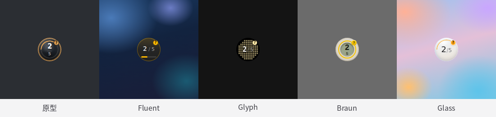
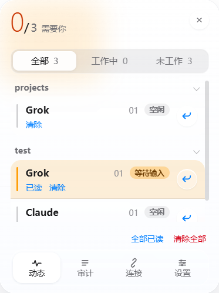
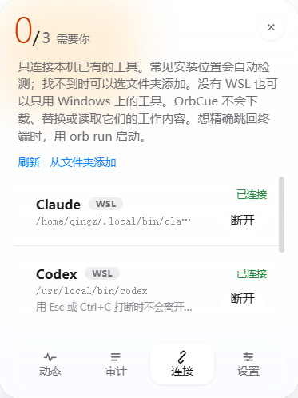

# OrbCue — The orb that cues you when an agent needs you.

[](https://github.com/QZYH123/OrbCue/releases/latest)
[](LICENSE)
[](#系统要求)


同时开着几个终端里的 AI 助手，窗口一多就很难看出谁在干活、谁在等你。

OrbCue 在 Windows 桌面上放一个小球：orb 是形态，cue 是该你出手了。**工作时只显示数量，需要你处理时才提醒。** 点开小球是按项目分组的列表，点条目上的返回箭头可以跳回对应终端。命令行是 `orb`。

<p align="center">
  
</p>

当前 **0.2.3**，桌面程序只在 Windows 上提供。安装包见 [GitHub Releases](https://github.com/QZYH123/OrbCue/releases/latest)。

- 不读取对话、提示词、命令或代码，也不替你操作这些工具
- 默认不联网；状态只保存在本机当前用户目录
- 支持的命令行工具：

| 工具 | 命令 |
| --- | --- |
| Claude Code | `claude` |
| Grok Build | `grok` |
| Codex | `codex` |
| Cursor Agent | `agent` / `cursor-agent` |

以上指的都是 CLI 版本。

## 目录

- [它做什么、不做什么](#它做什么不做什么)
- [系统要求](#系统要求)
- [安装](#安装)
- [开始使用](#开始使用)
- [界面](#界面)
- [连接时改了什么](#连接时改了什么)
- [隐私与数据](#隐私与数据)
- [常见问题](#常见问题)
- [卸载](#卸载)
- [给其他工具接入](#给其他工具接入)
- [从源码开发](#从源码开发)

## 它做什么、不做什么

### 做

- 多个工具共用一个小球。数字是「正在工作的主会话 / 当前列表里的主会话」，例如 `2/5`
- 等待输入、等待授权或失败时，弹一次系统通知并播提示音；正常完成只播提示音，不弹通知
- 在「连接」页接上本机已经装好的工具：不替换可执行文件，确认前会列出将要改的文件
- 从列表跳回终端。用 `orb run` 在 Windows Terminal 里开出的专属标签，可以精确回到那个标签

### 不做

- 不读取对话记录、提示词、命令、代码、终端输出或凭据
- 不扫描进程列表去猜测工具是否在工作
- 不替换工具的可执行文件；连接失败也不会下载或重装任何东西
- 不监听网络端口，不上传任何数据
- 面板不展示对话摘要，只显示工具名、所属项目和状态

## 系统要求

- Windows 10 / 11（x64）。小球和面板只在 Windows 上运行
- WSL 可选。装了之后，WSL 里的工具和 Windows 上的会出现在同一个小球里；没装不影响使用
- 精确跳到某一个标签只适用于 [Windows Terminal](https://aka.ms/terminal)，需用 `orb run` 或启动别名开出专属标签。窗口级跳回适用于 Windows Terminal、cmd / PowerShell 独立窗口、Alacritty、WezTerm、Git Bash（mintty）和 Tabby；VS Code、Cursor 等编辑器内置终端不行
- macOS 与 Linux 桌面暂未正式支持

## 安装

Windows 安装包在 [GitHub Releases](https://github.com/QZYH123/OrbCue/releases/latest)。下载 NSIS 安装包，装好后启动 OrbCue。

也可以从源码构建，步骤见 [从源码开发](docs/dev.md#构建-windows-桌面程序)。

装好并启动后，桌面出现小球。同一个用户只运行一份 OrbCue。开机自启在面板「设置」里打开。

## 开始使用

1. 启动 OrbCue，桌面右下角一带会出现小球
2. 点小球打开面板（或按 `Ctrl+Shift+Space`），底栏切到「连接」
3. 对要接入的工具点「连接」，核对将要修改的文件后点「确认连接」。找不到时点「从文件夹添加」
4. **新开**一个终端，照常使用原来的工具。连接前已经在跑的会话不会出现在小球上
5. 任务开始后，球上出现数字；需要你处理时右上角会出现 `?`（等待）或 `!`（失败）

退出：托盘图标 →「退出」。

## 界面

点小球展开面板；再点一次或点面板右上角 × 收起。托盘菜单可以「打开 OrbCue」、隐藏或显示小球、退出。

| 页面 | 作用 |
| --- | --- |
| 小球 | 桌面常驻。数字是工作中 / 追踪中；`?` 表示有任务在等你，`!` 表示有失败。可拖到屏幕边缘贴成半圆 |
| 动态 | 当前会话列表，按项目分组，可筛选全部 / 工作中 / 未工作 |
| 审计 | 本次运行里最近的完成、失败、等待和关闭，最多 128 条，只在内存中，重启即清空 |
| 连接 | 列出本机检测到的工具，确认后连接或断开 |
| 设置 | 外观、提示音、系统通知、开机自启、快捷键、圆标、侧边收起，以及启动别名 |

外观主题有五套：原型、Fluent、Glyph、Braun、Glass，在「设置」里切换。

<p align="center">
  
</p>

### 动态

每条会话显示工具名、项目和状态，没有对话内容。

<p align="center">
  
</p>

- **已读**：去掉等待提醒
- **清除**：把卡住的条目从列表拿掉。只影响 OrbCue 的显示，不会向工具发命令；清掉之后这条不会再回来
- **返回箭头**：跳回终端。用 `orb run` 开出的专属标签能精确回去（标签被拖出或合并过也有效）；自己手动开的终端只回到该窗口最近交互过的位置，窗口已经关掉时会提示失败，不会跳错地方
- 底栏「全部已读」「清除全部」对当前列表一次性操作
- 工具进程退出后，对应条目会自动消失
- 子任务计入所属的主任务，不单独占小球上的数字

要精确跳到某一个 Windows Terminal 标签：在「设置」里给启动方式起一个短命令（启动别名），然后用这个短命令在新标签里打开工具。没设别名时，在新开的 Windows Terminal 里运行 `orb run grok`（或 `claude` / `codex` 等）效果相同。第一次用之前需要先启动过一次 OrbCue，并**新开**终端。

### 连接

每一行是一个已检测到的工具，并标明在 Windows 还是 WSL。状态是「可连接」或「已连接」。

<p align="center">
  
</p>

- **连接**：先弹出将要改哪些文件，点「确认连接」才动手
- **断开**：只移除 OrbCue 自己写入的内容，不会动你后来改过的其他设置
- **刷新**：重新检测本机工具
- **从文件夹添加**：官方安装路径里找不到时，选包含可执行文件的文件夹

同名工具在 Windows 和 WSL 各装了一份，就各占一行，分开连接。Cursor 编辑器本身不会被当成命令行工具。

连接页会查看：桌面程序能看到的 PATH、用户 PATH，以及常见安装目录（例如 `%USERPROFILE%\.local\bin`、Grok Build 的 `%USERPROFILE%\.grok\bin`、Cursor 命令行的 `%LOCALAPPDATA%\cursor-agent`）。装了 WSL 时再查看 WSL 里的 PATH（WSL 里能看到的 Windows 程序不重复计）。

### 设置

- **启动别名**：给 `orb run` 起短命令，方便精确跳回
- **隐藏圆标**：小球右上角不再显示 `?` / `!`
- **收到侧边**：默认打开。拖到屏幕边缘约一个球宽内，小球会贴成半圆，略透明、不显示数字；鼠标悬停会沿同一边滑出来，移开后再贴回去。出现 `?` 或 `!` 时会保持展开，直到你再把它拖到边上。关掉则只是普通拖动
- **完成 / 等待 / 失败提示音**、**系统通知**
- **开机自启**：登录 Windows 后自动打开 OrbCue
- **全局快捷键**：默认 `Ctrl+Shift+Space` 打开或收起面板

## 连接时改了什么

连接方式取决于工具是否提供 hook（工具自带的事件通知机制）：

| 工具 | 连接方式 | 能报告的状态 |
| --- | --- | --- |
| Claude Code、Grok Build | 在该工具自己的配置里登记 hook | 开始、等待、完成、失败、关闭 |
| Cursor | 在该工具自己的配置里登记 hook | 开始、完成、失败、关闭；选择题不会标成「等待」 |
| Codex | 在该工具自己的配置里登记 hook | 开始、等待、完成、关闭；打断和报错看不到 |

限制会写在连接页对应行上：

- Cursor 命令行偶尔不会通知已经结束，任务会停在「工作中」，直到进程退出才消失
- Codex 用 Esc 或 Ctrl+C 打断当前回复时，不会通知 OrbCue，任务停在「工作中」；对话报错也不会显示为失败。在动态页点「清除」即可；退出 Codex 后任务也会从列表消失
- Claude Code / Codex 在授权框里点拒绝时，不会通知 OrbCue。小球会停在「等待授权」，直到它继续干活或这一轮结束；也可以在动态页点「清除」。Grok Build 点拒绝会马上回到工作中
- 首次修改 Claude Code / Codex / Cursor 的配置前，会保留一份备份（例如 `settings.json.orbcue.bak`）

## 隐私与数据

- 只在本机、当前用户范围内通信：Windows 用命名管道，WSL 里的命令行用 Unix socket；不监听任何网络端口
- 写入磁盘的只有：来源、任务 ID、状态、时间、已读标记、终端标记、项目路径。Windows 在 `%LOCALAPPDATA%\OrbCue\state.json`；WSL / Linux 命令行在 `$XDG_STATE_HOME/orbcue/state.json`（默认 `~/.local/state` 下）
- 任务摘要只在内存里短暂存在，不写盘；对话、提示词、命令一概不经手
- 重启后会恢复上述最小状态，但不会重播提醒；过期事件直接丢弃
- 判断工具进程是否退出时，只查询连接时记下的那一个进程，不扫描整个进程列表
- 提示音、界面或某个连接出问题，不影响状态服务本身；卡住的条目可以随时「清除」

## 常见问题

### 连接之前已经在跑的工具没有出现在小球上？

不会回填。请在连接完成之后新开终端再启动工具。

### 任务一直显示「工作中」？

工具可能被强制结束，或没有把「结束了」告诉 OrbCue（例如在 Codex 里按 Esc 打断）。在动态页点「清除」即可；进程真正退出后 OrbCue 也会自动清理。

### 授权框里点了拒绝，还显示等待授权？

Claude Code 和 Codex 不会把这次拒绝告诉 OrbCue。等到它继续干活或这一轮结束就会恢复；也可以点「清除」。Grok Build 没有这个问题。

### 点返回箭头找不到窗口，或不在那个标签？

自己开的终端只能回到最近交互的窗口。要精确跳到某个标签，用「设置」里的启动别名在 Windows Terminal 中启动工具。

### 小球不见了？

看托盘图标：可能选过「隐藏小球」。点「显示小球」，或用 `Ctrl+Shift+Space` 打开面板。开着「收到侧边」时，它也可能贴在屏幕边缘成半透明半圆，到四边找一下。

### Cursor 报 hook 失败，或任务不上小球？

Cursor CLI 把 hook 的空输出或非 JSON 输出当成失败。OrbCue 会回一个空 JSON 对象，避免 Cursor 自己报 hook 出错。若仍异常，到连接页断开再连接一次。

### 等你处理时没有系统通知？

在「设置」里打开系统通知，并在 Windows「设置 → 系统 → 通知」里允许 OrbCue。

### 没装 WSL 能用吗？

能。没装 WSL 的话连接页只显示 Windows 上的工具。

### 连接页找不到 Windows 上明明能用的工具？

像 fnm、nvm 这类只在某个终端里临时加路径的，桌面程序看不到。点「刷新」；官方安装一般会写进用户目录。仍没有时，点「从文件夹添加」，选那个可执行文件所在的文件夹。

### OrbCue 能看到我的对话内容吗？

不能。只接收工具主动发来的状态变化（开始了、在等你、完成了），见[隐私与数据](#隐私与数据)。

## 卸载

1. 面板「连接」页对每个工具点「断开」，移除 OrbCue 写入的 hook
2. 托盘「退出」。若用安装包安装，再到 Windows「设置 → 应用」里卸载
3. 如需彻底清理，删除 `%LOCALAPPDATA%\OrbCue`。用过 WSL 时再删 `~/.local/bin/orb`，以及 shell 配置文件中 `# >>> orbcue PATH >>>` 标记的段落

## 给其他工具接入

连接页目前只接上面列出的工具。其他工具如果能主动发状态，可以用 `orb start` / `orb waiting` / `orb complete` 这类命令接入，不必改 OrbCue 的代码。字段见 [`docs/event-contract.md`](docs/event-contract.md)，调用示例见 [`examples/mcp-skill-note.md`](examples/mcp-skill-note.md)。

## 从源码开发

需要 Rust 1.80+、Node.js 20+、npm。桌面壳是 Tauri 2，界面是 Svelte 5。在 Windows 上跑桌面程序：

```bash
npm ci --prefix frontend
npm run tauri -- dev
```

`npm --prefix frontend run dev` 只是浏览器里的界面预览（假数据），不是 OrbCue。

完整说明见 [`docs/dev.md`](docs/dev.md)。术语与边界见 [`docs/agents/domain.md`](docs/agents/domain.md)，设计决策见 [`docs/adr/`](docs/adr/)。

---

感谢 [LINUX DO](https://linux.do/) 社区对我 AI 学习的助力。

许可：[MIT](LICENSE)
