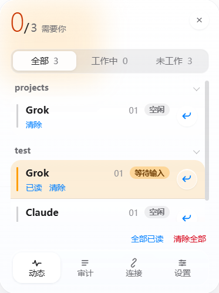
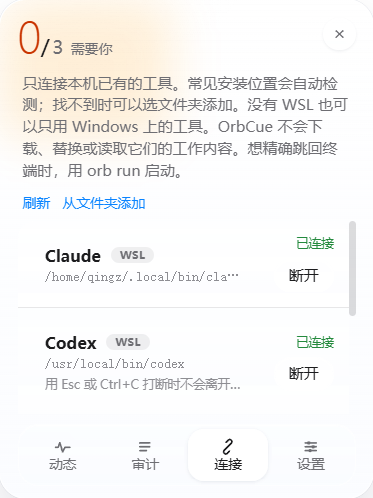
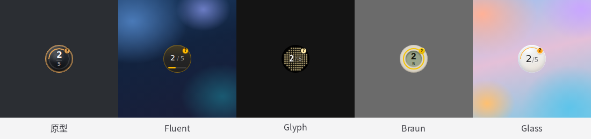

<div align="center">


# OrbCue

<h3>每一次上下文切换，都应该值得。</h3>

一颗放在 Windows 桌面上的小球，替你盯着终端里的 AI 助手。<br>
它们在忙，它就安静地数着；轮到你了，它才出声。

<sub>The orb that cues you when an agent needs you.</sub>

<p>
  <a href="https://github.com/QZYH123/OrbCue/releases/latest"></a>
  <a href="LICENSE"></a>
  <a href="#系统要求"></a>
  <a href="#支持的工具"></a>
</p>

[**下载安装**](https://github.com/QZYH123/OrbCue/releases/latest) · [快速开始](#快速开始) · [界面](#界面) · [隐私与数据](#隐私与数据) · [常见问题](#常见问题)

<br>


</div>

<br>

## 为什么需要它

同时开着几个 AI 助手，你以为自己在并行，其实一直在窗口之间来回切：切过去看一眼，还在跑；切回来，另一个已经等了你好一会儿。

OrbCue 把「盯着」这件事交给一颗小球。orb 是它的样子，cue 是它的本分：该你出手时，提醒你一次。

- **安静地数**：球上只显示「正在工作的主会话 / 当前列表里的主会话」，例如 `2/5`
- **该你时才出声**：等待输入、等待授权、失败或正常完成时，弹出一次系统通知并播放提示音
- **一眼看清**：点击小球展开面板，会话按项目分组，可按全部 / 工作中 / 未工作筛选
- **一键回到终端**：点击条目上的返回箭头，直接跳回对应的终端
- **离开座位也知道**：可选，把同一条提醒同步推送到手机上的 [ntfy](https://ntfy.sh/)
- **不用时贴边**：拖到屏幕边缘可贴成半圆，鼠标悬停时自动滑出
- **五套外观**：原型、Fluent、Glyph、Braun、Glass
- **不碰你的数据**：不读取对话、提示词、命令或代码，也不替你操作这些工具；默认不联网，状态只保存在本机

## 支持的工具

| 工具 | 命令 | 能报告的状态 |
| --- | --- | --- |
| Claude Code | `claude` | 开始、等待、完成、失败、关闭 |
| Grok Build | `grok` | 开始、等待、完成、失败、关闭 |
| Codex | `codex` | 开始、等待、完成、关闭（打断和报错看不到） |
| Cursor Agent | `agent` / `cursor-agent` | 开始、完成、失败、关闭（选择题不会标成「等待」） |

以上均指命令行（CLI）版本，不包含 Cursor 编辑器本身。编辑器（含 WSL Remote）与 CLI 共用用户级 `~/.cursor/hooks.json`，但 OrbCue 只认 `cursor-agent` 进程，编辑器里的 Agent / 子代理不会出现在小球上。无论是安装在 Windows 还是 WSL 里的工具都能接入，并在同一个小球上显示。其他工具也可以通过命令[自行接入](#给其他工具接入)。

## 快速开始

### 系统要求

- **Windows 10 / 11（x64）**：小球和面板仅在 Windows 上运行；暂未正式支持 macOS 与 Linux 桌面
- **WSL（可选）**：安装后，WSL 内的工具与 Windows 上的工具会出现在同一个小球里；未安装不影响使用
- **Windows Terminal（可选）**：仅在需要精确跳回某一个标签页时才需要，详见[精确跳回终端](#精确跳回终端)

### 安装

前往 [GitHub Releases](https://github.com/QZYH123/OrbCue/releases/latest) 下载 NSIS 安装包。安装完成后启动 OrbCue，桌面右下角会出现小球。同一个用户下只运行一个 OrbCue 实例；如需开机自启，可在面板「设置」中开启。

也可以从源码构建，步骤见[从源码开发](docs/dev.md#构建-windows-桌面程序)。

### 第一次使用

1. 点击小球打开面板（或按快捷键 `Ctrl+Shift+Space`），底栏切换到「连接」
2. 对要接入的工具点击「连接」，核对将要修改的文件后点击「确认连接」；未检测到时点击「从文件夹添加」
3. **新开**一个终端，照常使用原有工具。连接前已经在运行的会话不会出现在小球上
4. 任务开始后，球上会显示数字；需要你处理时，右上角会出现 `?`（等待）或 `!`（失败）

退出方式：托盘图标 →「退出」。

## 界面

点击小球可展开面板；再次点击小球，或点击面板右上角 × 即可收起。通过托盘菜单可以「打开 OrbCue」、隐藏或显示小球，以及退出程序。

<p align="center">
  
  &nbsp;&nbsp;
  
</p>
<p align="center"><sub>左：动态页　　右：连接页</sub></p>

| 页面 | 作用 |
| --- | --- |
| 小球 | 桌面常驻。数字表示「工作中 / 追踪中」；`?` 表示有任务在等你，`!` 表示有任务失败。可拖到屏幕边缘贴成半圆 |
| 动态 | 当前会话列表，按项目分组展示，可筛选全部 / 工作中 / 未工作 |
| 审计 | 本次运行中最近的完成、失败、等待和关闭记录，最多 128 条；仅保存在内存中，重启即清空 |
| 连接 | 列出本机检测到的工具，核对后进行连接或断开 |
| 设置 | 外观样式、提醒方式、小球行为和启动方式，详见[设置](#设置) |

### 动态

每条会话只显示工具名、所属项目和状态，不显示对话内容。

- **已读**：消除当前的等待提醒标记
- **清除**：把卡住的条目从列表中移除。这只影响 OrbCue 的界面显示，不会向工具发送任何命令；清除后该条目不会再次出现
- **返回箭头**：跳回终端，具体能回到哪里见下一节
- 底栏「全部已读」「清除全部」可对当前列表执行批量操作
- 工具进程退出后，对应条目会自动消失
- 子任务计入所属的主任务，不单独占用小球上的计数

### 精确跳回终端

点击返回箭头能回到哪里，取决于终端是怎么打开的：

| 终端启动方式 | 点击返回箭头 |
| --- | --- |
| 用 `orb run`、原命令启动或启动别名打开的 Windows Terminal 专属标签 | 精确回到该标签页，标签页被拖出或合并过也依然有效 |
| 手动打开的普通终端 | 回到该窗口最近交互过的位置；窗口若已关闭则提示失败，不会跳错地方 |

窗口级跳转支持 Windows Terminal、cmd / PowerShell 独立窗口、Alacritty、WezTerm、Git Bash（mintty）和 Tabby；不支持 VS Code、Cursor 等编辑器的内置终端。

打开专属标签页的三种方式（任选其一）：

- **原命令启动**：在「设置」中开启后，新开终端里直接输入已连接的命令（`claude`、`codex`、`grok`，Cursor 使用 `agent` 或 `cursor-agent`），效果等同于 `orb run` 加上对应工具
- **启动别名**：在「设置」中为 `orb run` 设置简短命令别名
- **直接运行**：在新开的 Windows Terminal 里运行 `orb run grok`

首次使用前，需要先启动过一次 OrbCue，并**重新打开**终端。开启原命令启动后，若想在当前终端直接运行原版程序，可使用 `command grok`。

### 连接

列表中每一行是一个已检测到的工具，并标明运行在 Windows 还是 WSL，状态为「可连接」或「已连接」。

- **连接**：点击后先列出将要修改的文件，点击「确认连接」后才执行写入
- **断开**：仅移除 OrbCue 自身写入的内容，不会改动你后来改过的其他设置
- **刷新**：重新检测本机安装的工具
- **从文件夹添加**：如果在默认安装路径中找不到，可手动选择包含可执行文件的文件夹

同名工具在 Windows 和 WSL 各装了一份时，会各占一行，分开连接。

连接页会扫描：桌面程序可读取的 PATH、用户 PATH，以及常见安装路径（例如 `%USERPROFILE%\.local\bin`、Grok Build 的 `%USERPROFILE%\.grok\bin`、Cursor 命令行的 `%LOCALAPPDATA%\cursor-agent`）。安装了 WSL 时还会扫描 WSL 内的 PATH（WSL 中可访问的 Windows 程序不会重复计算）。

### 设置

| 设置 | 默⁠认 | 说明 |
| --- | :---: | --- |
| **提醒** | | |
| 提示音 | 开 | 完成、等待、失败三种状态各自独立开关 |
| 系统通知 | 开 | 等待输入、等待授权或任务失败时弹出一次系统通知 |
| 完成通知 | 开 | 任务正常完成时，电脑和手机各通知一次。关闭后完成仅播放提示音；「系统通知」关闭时电脑端不弹窗，手机端仍按此项设置推送 |
| 手机提醒 | 关 | 填入 ntfy 话题地址后，等待输入、等待授权、失败时各推送一次，正常完成跟随「完成通知」。留空则不联网，推送内容见[隐私与数据](#隐私与数据) |
| **小球** | | |
| 外观 | | 原型、Fluent、Glyph、Braun、Glass 五套 |
| 隐藏圆标 | 关 | 小球右上角不再显示 `?` 和 `!` 标记 |
| 收到侧边 | 开 | 拖到屏幕边缘约一个球宽内，会自动贴边变成半透明、不显示数字的半圆；鼠标悬停时沿同一侧滑出，移开后再贴回。出现 `?` 或 `!` 时保持展开，直到你再次把它拖到边缘。关闭此项则为普通拖动 |
| **启动** | | |
| 原命令启动 | 关 | 新开终端里直接输入已连接的命令，效果等同于 `orb run` 加上对应工具。不改动原程序本身 |
| 启动别名 | | 为 `orb run` 设置短命令别名，方便精确跳回 |
| 启动时替换当前标签页 | 关 | 打开新标签页成功后关闭当前标签页（等同于 `orb run --close`，仅交互式终端有效） |
| 开机自启 | 关 | 登录 Windows 后自动启动 OrbCue |
| 全局快捷键 | 开 | 使用快捷键 `Ctrl+Shift+Space` 打开或收起面板 |

<p align="center">
  
</p>

## 连接时改了什么

每个工具都通过其自带的 hook（事件通知机制）接入：OrbCue 在该工具自己的配置里登记 hook，不替换任何可执行文件。

- 连接前先列出将要修改的文件，经确认后才动手写入
- 首次修改 Claude Code / Codex / Cursor 的配置前，会自动保留一份备份（例如 `settings.json.orbcue.bak`）
- 断开连接时，仅移除 OrbCue 自身写入的内容
- 即使连接失败，也不会下载或重装任何东西

已知限制（连接页对应行上也会注明）：

- **Cursor**：打印模式（`agent -p`）没有回合结束通知，条目要等进程退出后才消失；交互回合会标成「已完成」
- **Codex**：使用 Esc 或 Ctrl+C 打断当前回复时不会通知 OrbCue，任务会停在「工作中」；对话报错也不会显示为失败。在动态页点击「清除」即可，退出 Codex 后任务也会从列表中消失
- **Claude Code / Codex**：在授权提示框中点击拒绝时不会通知 OrbCue，小球会停留在「等待授权」，直到工具继续执行或该轮对话结束；也可以在动态页点击「清除」。Grok Build 点击拒绝后会立刻回到工作中

## 隐私与数据

OrbCue 只接收工具主动发来的状态变化：开始了、在等你、完成了。

**不做的事**

- 不读取对话记录、提示词、命令、代码、终端输出或敏感凭据；面板不展示对话摘要，只显示工具名、所属项目和状态
- 不扫描进程列表去猜测工具是否在工作。判断进程是否退出时，只查询连接时记下的那一个进程
- 不监听网络端口，默认不上传任何数据

**存了什么、保存在哪**

- 只在本机、当前用户范围内通信：Windows 使用命名管道，WSL 命令行使用 Unix socket
- 写入磁盘的内容仅有：来源、任务 ID、状态、时间、已读标记、终端标记、项目路径
  - Windows：`%LOCALAPPDATA%\OrbCue\state.json`
  - WSL / Linux 命令行：`$XDG_STATE_HOME/orbcue/state.json`（默认在 `~/.local/state` 下）
- 任务摘要只在内存中短暂存在，不落盘
- 重启后恢复上述最小状态，但不会重复播放旧提醒；过期事件直接丢弃

**手机提醒（可选）**

- 默认关闭。开启后，话题地址保存在 `%LOCALAPPDATA%\OrbCue\phone-notify.url`
- 推送内容仅为「等待输入」「等待授权」「任务失败」或「任务完成」，外加工具名；有项目时再附加项目文件夹名。完整路径、对话内容、执行命令一律不发
- 是否发送任务完成通知取决于「完成通知」设置。清空地址即停止推送
- 建议使用较长的话题名：任何知道该话题地址的人都能看到这些提醒

提示音、界面渲染或某个工具连接异常，都不会影响后台状态服务本身；卡住的条目随时可以在动态页「清除」。

## 常见问题

<details>
<summary><b>连接之前已经在跑的工具，没有出现在小球上？</b></summary>

<br>不会回溯补充。请在完成连接后重新打开终端，再启动工具。

</details>

<details>
<summary><b>任务一直显示「工作中」？</b></summary>

<br>工具可能被强制结束，或者没有把结束状态通知 OrbCue（例如在 Codex 里按 Esc 打断）。在动态页点击「清除」即可；进程真正退出后，OrbCue 也会自动清理。

</details>

<details>
<summary><b>授权框里点了拒绝，为什么还显示等待授权？</b></summary>

<br>Claude Code 和 Codex 不会把这次拒绝通知 OrbCue。等待它继续干活或当前轮次结束即可恢复；也可以在动态页点击「清除」。Grok Build 没有这个问题。

</details>

<details>
<summary><b>点返回箭头找不到窗口，或没有回到目标标签页？</b></summary>

<br>手动打开的终端只能跳回最近交互过的窗口。要精确跳到某个标签页，请使用原命令启动、启动别名或通过 `orb run` 在 Windows Terminal 中启动工具，详见[精确跳回终端](#精确跳回终端)。

</details>

<details>
<summary><b>小球不见了？</b></summary>

<br>检查托盘图标：可能之前勾选了「隐藏小球」，点击「显示小球」即可，或按 `Ctrl+Shift+Space` 直接打开面板。开启「收到侧边」时，小球也可能贴在屏幕边缘变成了半透明半圆，到屏幕四周找一下。

</details>

<details>
<summary><b>Cursor 报 hook 失败，或任务没有显示在小球上？</b></summary>

<br>Cursor CLI 会把 hook 的空输出或非 JSON 输出当成执行失败。OrbCue 会返回一个空 JSON 对象，避免 Cursor 自己报错。如果仍有异常，可以在连接页断开后重新连接一次。

</details>

<details>
<summary><b>需要处理时没有弹出系统通知？</b></summary>

<br>请在「设置」里打开系统通知，并在 Windows「设置 → 系统 → 通知」里允许 OrbCue 发送通知。若任务正常完成时电脑或手机没有收到通知，再检查「完成通知」是否处于开启状态。

</details>

<details>
<summary><b>人离开电脑时，手机能响吗？</b></summary>

<br>可以。在安卓手机上安装 ntfy，订阅一个只有你自己知道的长话题，把 `https://ntfy.sh/话题名` 填进「设置」里的手机提醒并点击「应用」，手机会先收到一条测试推送。

之后在等待输入、等待授权、任务失败，以及开启了完成通知时的正常完成，都会向手机推送一次。推送内容仅包含当前提示、工具名和项目文件夹名。使用时 OrbCue 需保持运行，电脑需能访问该网址；留空则不推送。

</details>

<details>
<summary><b>没装 WSL 能用吗？</b></summary>

<br>能。未安装 WSL 时，连接页只显示 Windows 环境下的工具。

</details>

<details>
<summary><b>连接页找不到 Windows 上明明能用的工具？</b></summary>

<br>像 fnm、nvm 这类只在特定终端配置里临时注入 PATH 的工具，桌面程序无法直接感知。可以先点击「刷新」；官方安装通常会写入用户目录。若仍未检测到，点击「从文件夹添加」，手动选择该可执行文件所在的文件夹。

</details>

<details>
<summary><b>OrbCue 能看到我的对话内容吗？</b></summary>

<br>不能。它只接收工具主动发来的状态变化（开始了、在等你、完成了），详见[隐私与数据](#隐私与数据)。

</details>

## 卸载

1. 在面板「连接」页对每个工具点击「断开」，移除 OrbCue 写入的 hook
2. 托盘图标 →「退出」。若使用安装包安装，再到 Windows「设置 → 应用」中卸载
3. 如需彻底清理，手动删除 `%LOCALAPPDATA%\OrbCue`。如果使用过 WSL，再删除 `~/.local/bin/orb`，以及 shell 配置文件中带有 `# >>> orbcue PATH >>>` 标记的段落

## 给其他工具接入

连接页目前只预置接入了上面列出的工具。其他工具如果能主动发送状态，可以通过 `orb start` / `orb waiting` / `orb complete` 这类命令接入，无需修改 OrbCue 的代码。字段说明见 [`docs/event-contract.md`](docs/event-contract.md)，调用示例见 [`examples/mcp-skill-note.md`](examples/mcp-skill-note.md)。

## 从源码开发

需要 Rust 1.80+、Node.js 20+ 以及 npm。桌面端基于 Tauri 2，界面基于 Svelte 5。在 Windows 上运行桌面程序：

```bash
npm ci --prefix frontend
npm run tauri -- dev
```

`npm --prefix frontend run dev` 只是浏览器里的界面预览（使用模拟数据），并不是完整的 OrbCue。

| 文档 | 内容 |
| --- | --- |
| [`docs/dev.md`](docs/dev.md) | 完整的开发与构建说明 |
| [`docs/how-it-works.md`](docs/how-it-works.md) | 工作机制 |
| [`docs/agents/domain.md`](docs/agents/domain.md) | 术语与边界 |

<br>

---

<div align="center">

感谢 [LINUX DO](https://linux.do/) 社区对我 AI 学习的助力

<sub>许可：[MIT](LICENSE)</sub>

</div>
